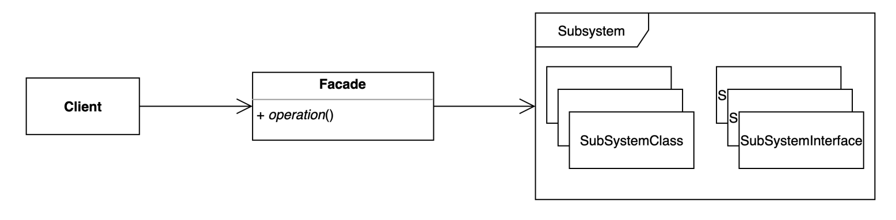
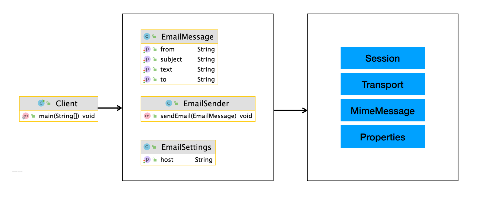

# 퍼사드패턴

### 퍼사드패턴

- 불어에서 온 언어, 건물의 입구, 전경을 의미한다
    - Facade Pattern을 통해 디테일한 내용을 숨긴다
- 복잡한 서브 시스템 의존성을 최소화하는 방법
    - 클라이어트가 사용해야 하는 복잡한 서브 시스템 의존성을 간단한 인터페이스로 추상화 할 수 있다





```java
public class Client {

    public static void main(String[] args) {
        String to = "keesun@whiteship.me";
        String from = "whiteship@whiteship.me";
        String host = "127.0.0.1";

        Properties properties = System.getProperties();
        properties.setProperty("mail.smtp.host", host);

        Session session = Session.getDefaultInstance(properties);

        try {
            MimeMessage message = new MimeMessage(session);
            message.setFrom(new InternetAddress(from));
            message.addRecipient(Message.RecipientType.TO, new InternetAddress(to));
            message.setSubject("Test Mail from Java Program");
            message.setText("message");

            Transport.send(message);
        } catch (MessagingException e) {
            e.printStackTrace();
        }
    }
}
```

- 퍼사드패턴을 적용하기 전에 Client에 모든 코드가 노출되어 있는 상황이다
- 소프트웨어 설계는 의존성이 강할수록 해당 코드를 변경하기도 어렵고 변경해야 하는 이유도 많아지고 테스트 하기도 어려워진다
    - 따라서 가급적 유연하게 설계를 해야 한다
        - SOLID 원칙이 나온 이유

> 클라이언트의 노출을 최소화 하고 서버 로직에서 처리한다
>

```java
public static void main(String[] args) {
        EmailSettings emailSettings = new EmailSettings();
        emailSettings.setHost("127.0.0.1");

        EmailSender emailSender = new EmailSender(emailSettings);

        EmailMessage emailMessage = new EmailMessage();
        emailMessage.setFrom("keesun");
        emailMessage.setTo("whiteship");
        emailMessage.setCc("일남");
        emailMessage.setSubject("오징어게임");
        emailMessage.setText("밖은 더 지옥이더라고..");

        emailSender.sendEmail(emailMessage);
    }
```

```java
public class EmailSender {

    private EmailSettings emailSettings;

    public EmailSender(EmailSettings emailSettings) {
        this.emailSettings = emailSettings;
    }

    /**
     * 이메일 보내는 메소드
     * @param emailMessage
     */
    public void sendEmail(EmailMessage emailMessage) {
        Properties properties = System.getProperties();
        properties.setProperty("mail.smtp.host", emailSettings.getHost());

        Session session = Session.getDefaultInstance(properties);

        try {
            MimeMessage message = new MimeMessage(session);
            message.setFrom(new InternetAddress(emailMessage.getFrom()));
            message.addRecipient(Message.RecipientType.TO, new InternetAddress(emailMessage.getTo()));
            message.addRecipient(Message.RecipientType.CC, new InternetAddress(emailMessage.getCc()));
            message.setSubject(emailMessage.getSubject());
            message.setText(emailMessage.getText());

            Transport.send(message);
        } catch (MessagingException e) {
            e.printStackTrace();
        }
    }

}
```

- 퍼사드 패턴을 적용한 이후에 Clinet 코드의 의존성이 줄어들었다
- 각각의 필요한 상황에 따라 `EmailSender` , `EmailSettings` , `EmailMessage` 등의 class를 생성해 관리할 수 있다
- 얼핏 보면 조삼모사처럼 보이지만 이메일을 보내는 작업을 여러 클라이언트에서 처리할 경우 효율적으로 처리가 가능하다

---

### 퍼사드패턴의 장단점

**장점**

- 서브 시스템에 대한 의존성을 한 곳에 모을 수 있다

**단점**

- 퍼사드 클래스가 서브 시스템에 대한 모든 의존성을 가지게 된다
    - Client의 의존성은 유연해졌지만 서버 코드에 대한 의존성은 여전히 있는 상황이다

### 퍼사드 패턴의 실무 적용

- 스프링
    - Spring MVC
    - 스프링이 제공하는 대부분의 기술 독립적인 인터페이스와 그 구현체