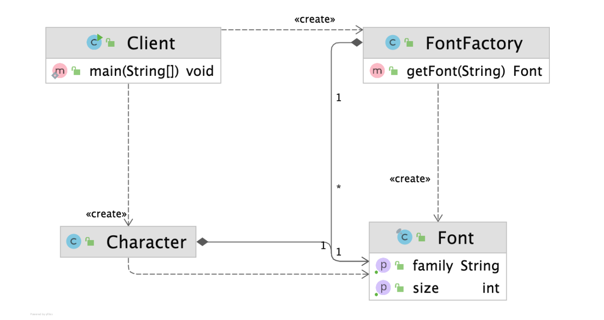

# 플라이웨이트(Flyweight) 패턴

### 플라이웨이트 패턴

- 객체를 가볍게 만들어 메모리 사용을 줄이는 패턴
- 자주 변하는 속성 (외적인 속성)과 변하지 않는 속성(내적인 속성) 을 분리하고 재사용하여 메모리 사용을 줄일 수 있다




- 가벼운 많은 인터페이스를 만들다 보면 메모리가 많이 사용되게 된다
    - 공통되는 부분을 따로 모아서 재사용한다

```java
public static void main(String[] args) {
        Character c1 = new Character('h', "white", "Nanum", 12);
        Character c2 = new Character('e', "white", "Nanum", 12);
        Character c3 = new Character('l', "white", "Nanum", 12);
        Character c4 = new Character('l', "white", "Nanum", 12);
        Character c5 = new Character('o', "white", "Nanum", 12);
    }
```

- Flyweight 패턴을 적용하기 전, 폰트와 폰트 사이즈를 “Nanum” , 12 로 각각 받고 있다

```java
public static void main(String[] args) {
        FontFactory fontFactory = new FontFactory();
        Character c1 = new Character('h', "white", fontFactory.getFont("nanum:12"));
        Character c2 = new Character('e', "white", fontFactory.getFont("nanum:12"));
        Character c3 = new Character('l', "white", fontFactory.getFont("nanum:12"));
    }
```

```java
public class FontFactory {

    private Map<String, Font> cache = new HashMap<>();

    public Font getFont(String font) {
        if (cache.containsKey(font)) {
            return cache.get(font);
        } else {
            String[] split = font.split(":");
            Font newFont = new Font(split[0], Integer.parseInt(split[1]));
            cache.put(font, newFont);
            return newFont;
        }
    }
}
```

- Flyweight 패턴을 적용한 이후 `fontFactory.getFont("nanum:12")` 의 Object 형태로 글꼴과 글꼴 사이즈를 처리하고 있다
    - 반복되는 코드를 Object 시켜 메모리 사용량의 효율성을 높일 수 있다

### Flyweight 객체의 Immutable

```java
public final class Font {

    final String family;

    final int size;

    public Font(String family, int size) {
        this.family = family;
        this.size = size;
    }

    public String getFamily() {
        return family;
    }

    public int getSize() {
        return size;
    }
}
```

> 유의해야 할 점은 Flyweight 객체는 항상 immutable 하게 만들어야 한다
변경하면 다른 로직에 크게 영향을 줄 수 있기 때문이다
>
- 따라서 final class Font를 통해 객체의 상속을 막고 final로 변수를 선언함을 통해 Flyweight 객체를 immutable 하게 처리하였다

### 플라이웨이트 패턴의 장단점

**장점**

- 애플리케이션에 사용하는 메모리를 줄일 수 있다

**단점**

- 코드의 복잡도가 증가할 수 밖에 없다
    - 불필요한 코드가 증가하게 되니 실무에서 적용시 PR에서 해당 코드가 작성된 이유를 언급해주는것이 협업시 유용할 것이다


### 플라이웨이트 패턴의 실무 적용

- 자바
    - Integer.valueOf(int)
    - 캐시를 제공한다