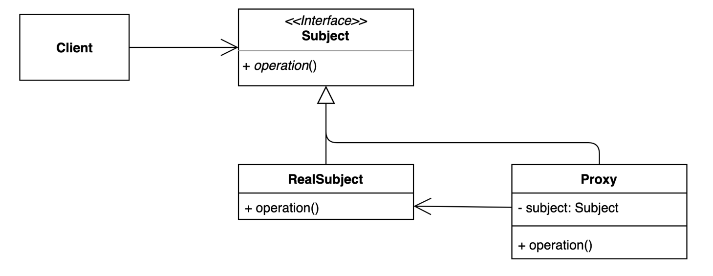
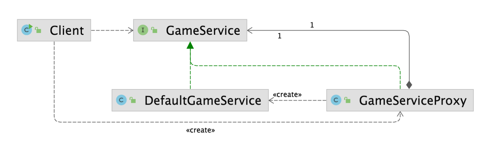

### 프록시(Proxy) 패턴

- 대리, 대리인
    - 특정한 객체에 접근하기 전에 Proxy 객체를 지나 접근한다
    - 맨 처음의 요청은 Proxy가 받아 처리한다
- 특정 객체에 대한 접근을 제어하거나 기능을 추가할 수 있는 패턴
    - 초기화 지연, 접근 제어, 로깅, 캐싱 등 다양하게 응용해서 사용할 수 있다






```java
public interface GameService {

    void startGame();
}

```

```java
public class DefaultGameService implements GameService {

    @Override
    public void startGame() {
        System.out.println("이 자리에 오신 여러분을 진심으로 환영합니다.");
    }
}
```

```java
public class GameServiceProxy implements GameService {

    private GameService gameService;

    @Override
    public void startGame() {
        long before = System.currentTimeMillis();
        if (this.gameService == null) {
            this.gameService = new DefaultGameService();
        }

        gameService.startGame();
        System.out.println(System.currentTimeMillis() - before);
    }
}
```

```java
public class Client {

    public static void main(String[] args) {
        GameService gameService = new GameServiceProxy();
        gameService.startGame();
    }
}
```

- GameServiceProxy.class 객체는 Decorator 패턴 처럼 상위 참조 변수인 GameService를 class 내에 지니고 있다
- Client에서 GameService를 호출할 때 항상 GameServiceProxy를 거치게 된다

---

### 클래스 상속 vs 인터페이스 구현체

- 클래스 상속을 사용하는 것보다 인터페이스 구현체 방식으로 만드는 것이 더 유용하다
1. final 키워드가 붙은 class는 상속화 할 수 없다
2. Java는 다중 상속이 불가능 하기 때문에 인터페이스 구현체를 활용하는 것이 확장성이 더 높다

---

### 프록시 패턴의 장단점

**장점**

- 기존 코드를 변경하지 않고 새로운 기능을 추가할 수 있다
- 기존 코드가 해야 하는 일만 유지할 수 있다
- 기능 추가 및 초기화 지연 등으로 다양하게 활용할 수 있다

**단점**

- 코드의 복잡도가 증가한다

---

### 프록시 패턴의 실무 적용

- 자바
    - 다이나믹 프록시, java.lang.reflect.Proxy
    - 다이나믹 프록시를 활용하면 Runtime 시점에 인터페이스를 동적으로 만들 수 있다
    - 여러개의 메소드와 여러개의 클래스에 Proxy를 적용하는 과정은 번거롭기 때문에 동적 dynamic Proxy를 적용하면 효율적으로 처리가 가능하다
- 스프링
    - 스프링 AOP

**스프링 AOP**

- 흩어질 수 있는 코드를 Aspect로 모아 처리 할 수 있다
- 스프링 AOP는 스프링이 관리 할 수 있는 bean만 관리할 수 있다
- 스프링 AOP에 대한 학습은 추가적으로 따로 진행해야 한다
    - @Transactional 어노테이션도 스프링 AOP의 한 종류이다

---