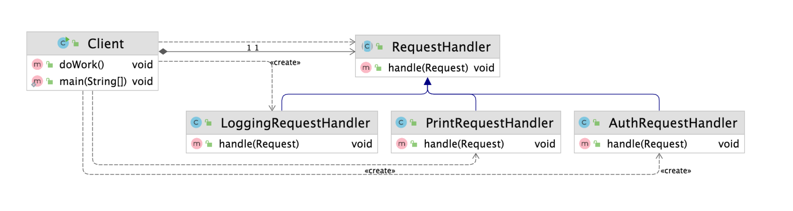

# 책임 연쇄 패턴

### 책임 연쇄 패턴 (Chain-of-Responsibility)

- 요청을 보내는 쪽과 요청을 처리하는 쪽의 분리하는 패턴




- RequestHandler의 handle 메소드 자체를 바꾸는 것은 단일책임원칙에 어긋난다
- RequestHandler
    - LoggingRequestHandler
    - PrintRequestHandler
    - AuthRequestHandler

```java
public class Client {

    private RequestHandler requestHandler;

    public Client(RequestHandler requestHandler) {
        this.requestHandler = requestHandler;
    }

    public void doWork() {
        Request request = new Request("이번 놀이는 뽑기입니다.");
        requestHandler.handle(request);
    }

    public static void main(String[] args) {
        // main 메소드에서 밑에 내용과 같이 chain 형태로 호출 한다
				RequestHandler chain = new AuthRequestHandler(new LoggingRequestHandler(new PrintRequestHandler(null)));
        Client client = new Client(chain);
        client.doWork();
    }
}
```

- Client는 어떤 구체적인 Handler를 가져와 사용할지를 결정하지 않고 RequestHandler만 가져와 `chain` 형태로 사용한다
- chain의 순서가 중요할 수도 중요하지 않을 수도 있다. 이는 어플리케이션의 성격에 따라 달라진다

```java
public abstract class RequestHandler {

    private RequestHandler nextHandler;

    public RequestHandler(RequestHandler nextHandler) {
        this.nextHandler = nextHandler;
    }

    public void handle(Request request) {
        if (nextHandler != null) {
            nextHandler.handle(request);
        }
    }
}
```

```java
public class LoggingRequestHandler extends RequestHandler {

    public LoggingRequestHandler(RequestHandler nextHandler) {
        super(nextHandler);
    }

    @Override
    public void handle(Request request) {
        System.out.println("로깅");
        super.handle(request);
    }
}
```

```java
public class PrintRequestHandler extends RequestHandler {

    public PrintRequestHandler(RequestHandler nextHandler) {
        super(nextHandler);
    }

    @Override
    public void handle(Request request) {
        System.out.println(request.getBody());
        super.handle(request);
    }
}
```

```java
public class AuthRequestHandler extends RequestHandler {

    public AuthRequestHandler(RequestHandler nextHandler) {
        super(nextHandler);
    }

    @Override
    public void handle(Request request) {
        System.out.println("인증이 되었는가?");
        super.handle(request);
    }
}
```

### 책임 연쇄 패턴의 장단점

**장점**

- 클라이언트 코드를 변경하지 않고 새로운 핸들러를 체인에 추가할 수 있다
- 각각의 체인은 자신이 해야하는 일만 한다
- 체인을 다양한 방법으로 구성할 수 있다

**단점**

- Chain 형태로 이루어져 있기 때문에 디버깅 하는 과정이 다소 어려울 수 있다

### 책임 연쇄 패턴

- 자바
    - 서블릿 필터
- 스프링
    - 스프링 시큐리티 필터