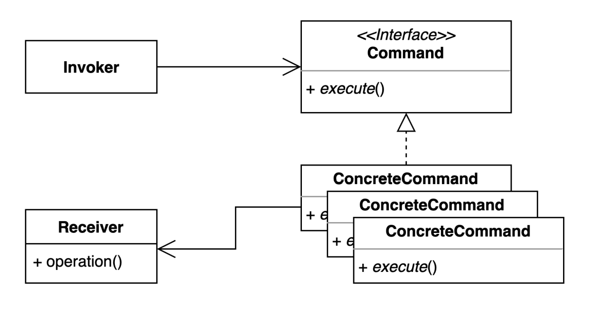
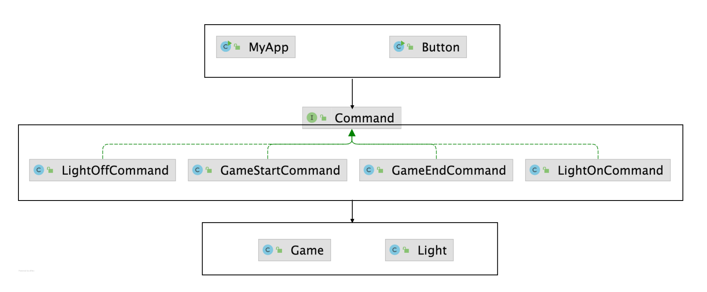

### 커맨드패턴

- 요청을 캡슐화 하여 호출자(invoker) 와 수신자(receiver) 를 분리하는 패턴
- 요청을 처리하는 방법이 바뀌더라도, 호출자의 코드는 변경되지 않는다.





- `MyApp.class` 와 `Button.class` 는 Invoker에 해당하며 요청을 처리하는 방법이 바뀌더라도 코드가 변경되지 않는다
- Command라는 Interface를 두어 요청을 캡슐화 처리해 여러개의 Command를 Implement 받는 식으로 구현된 패턴이다
- Command 영역에 해당하는 코드 들은 바뀔 수 밖에 없고 Invoker에 해당하는 호출 영역의 코드가 바뀌지 않는 것이 중요 하다

```java
// Invoker에 해당한다

public class Button {

    private Stack<Command> commands = new Stack<>();

    public void press(Command command) {
        command.execute();
        commands.push(command);
    }

    public void undo() {
        if (!commands.isEmpty()) {
            Command command = commands.pop();
            command.undo();
        }
    }

    public static void main(String[] args) {
        Button button = new Button();
        button.press(new GameStartCommand(new Game()));
        button.press(new LightOnCommand(new Light()));
        button.undo();
        button.undo();
    }

}

public class MyApp {

    private Command command;

    public MyApp(Command command) {
        this.command = command;
    }

    public void press() {
        command.execute();
    }

    public static void main(String[] args) {
        MyApp myApp = new MyApp(new GameStartCommand(new Game()));
    }
}

```

```java
public interface Command {

    void execute();

    void undo();

}
```

```java

public class GameStartCommand implements Command {

    private Game game;

    public GameStartCommand(Game game) {
        this.game = game;
    }

    @Override
    public void execute() {
        game.start();
    }

    @Override
    public void undo() {
        new GameEndCommand(this.game).execute();
    }
}
```

### 커맨드 패턴의 장단점

**장점**

- 기존 코드를 변경하지 않고 새로운 커맨드를 만들 수 있다
- 수신자의 코드가 변경되어도 호출자의 코드는 변경되지 않는다
- 커맨드 객체를 로깅, DB에 저장, 네트워크로 전송 하는 등 다양한 방법으로 활용할 수도 있다

**단점**

- 코드가 복잡하고 클래스가 많아진다

### 커맨드 패턴의 실무 적용

- 자바
    - Runnable
    - 람다
    - 메소드 래퍼런스
- 스프링
    - SimpleJdbcInsert
    - SimpleJdbcCall