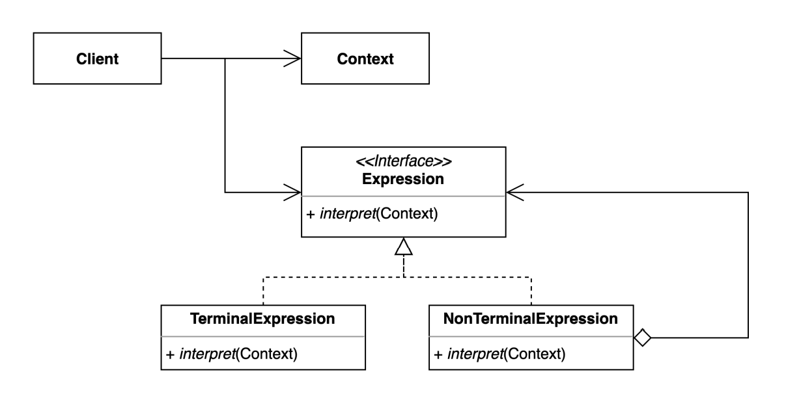
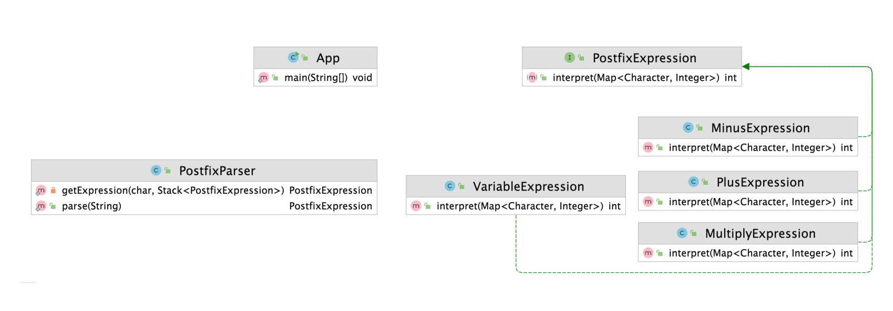

# 인터프리터 패턴

### 인터프리터 패턴

- 자주 등장하는 문제를 간단한 언어로 정의하고 재사용하는 패턴
- 반복되는 문제 패턴을 언어 또는 문법으로 정의하고 확장할 수 있다



- 우리가 일을 하다가 자주 해결해야 하는 문제가 발생하는데 이를 Custom화 해서 사용한다
    - ex) 정규 표현식
- 인터프리터 패턴은 Composit 패턴과 유사하게 생겼다



```java
public class App {

    public static void main(String[] args) {
        PostfixExpression expression = PostfixParser.parse("xyz+-a+");
        int result = expression.interpret(Map.of('x', 1, 'y', 2, 'z', 3, 'a', 4));
        System.out.println(result);
    }
}
```

```java
public interface PostfixExpression {

    int interpret(Map<Character, Integer> context);

}
```

```java
public class PlusExpression implements PostfixExpression {

    private PostfixExpression left;

    private PostfixExpression right;

    public PlusExpression(PostfixExpression left, PostfixExpression right) {
        this.left = left;
        this.right = right;
    }

    @Override
    public int interpret(Map<Character, Integer> context) {
        return left.interpret(context) + right.interpret(context);
    }
}
```

```java
public class MultiplyExpression implements PostfixExpression{

    private PostfixExpression left, right;

    public MultiplyExpression(PostfixExpression left, PostfixExpression right) {
        this.left = left;
        this.right = right;
    }

    @Override
    public int interpret(Map<Character, Integer> context) {
        return left.interpret(context) * right.interpret(context);
    }
}
```

```java
public class MinusExpression implements PostfixExpression {

    private PostfixExpression left;

    private PostfixExpression right;

    public MinusExpression(PostfixExpression left, PostfixExpression right) {
        this.left = left;
        this.right = right;
    }

    @Override
    public int interpret(Map<Character, Integer> context) {
        return left.interpret(context) - right.interpret(context);
    }
}
```

```java
public class VariableExpression implements PostfixExpression {

    private Character character;

    public VariableExpression(Character character) {
        this.character = character;
    }

    @Override
    public int interpret(Map<Character, Integer> context) {
        return context.get(this.character);
    }
}
```

- PostfixExpression은 Clinet에서 받는 Interface 구현체이다. 내가 정의하고 싶은 기능은 `VariableExpression` ,`MinuxExpression` , `MultiplyExpression` 과 같은 구현 Class를 만들어 interpret 메소드에 구현한다

```java
public class PostfixParser {

    public static PostfixExpression parse(String expression) {
        Stack<PostfixExpression> stack = new Stack<>();
        for (char c : expression.toCharArray()) {
            stack.push(getExpression(c, stack));
        }
        return stack.pop();
    }

    private static PostfixExpression getExpression(char c, Stack<PostfixExpression> stack) {
        switch (c) {
            case '+':
                return new PlusExpression(stack.pop(), stack.pop());
            case '-':
                PostfixExpression right = stack.pop();
                PostfixExpression left = stack.pop();
                return new MinusExpression(left, right);
            default:
                return new VariableExpression(c);
        }
    }
}
```

- PostfixParser는 기능이 추가됨에 따라 변경될 수 밖에 없는 클래스이다
- 컴퓨터가 이해할 수 있는 언어가 아닌 우리가 알고있는 문자로 Parsing 해주는 클래스이다

### 인터프리터 패턴의 장단점

- 장점
    - 자주 등장하는 문제 패턴을 언어와 문법으로 정의할 수 있다
    - 기존 코드를 변경하지 않고 새로운 Expression을 추가할 수 있다
- 단점
    - 복잡한 문법을 표현하려면 Expression과 Parser가 복잡해진다

> 인터프리터를 만드는 과정은 시간이 꽤 걸릴 수 있다. 따라서 공수를 따져보며 얼마나 자주 쓰이는 기능인지를 판별할 필요성이 있다
>

### 인터프리터 패턴의 실무 적용

- 자바
    - 자바 컴파일러
    - 정규 표현식
- 스프링
    - Spring Expression Language
    - `$Value`