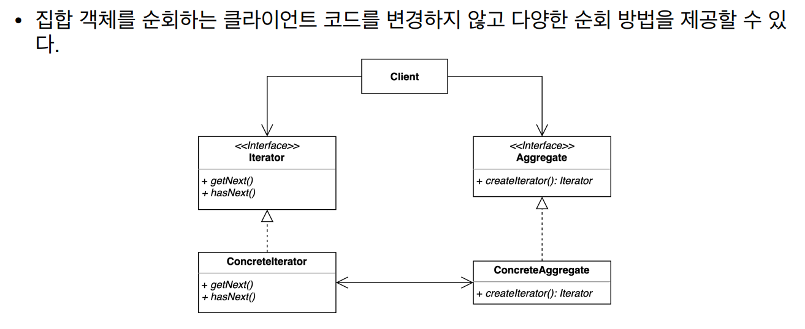
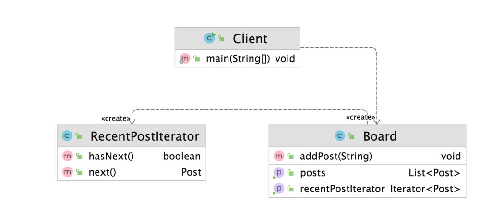

# 이터레이터 패턴

### 이터레이터 패턴

- 집합 객체 내부 구조를 노출시키지 않고 순회 하는 방법을 제공하는 패턴





```java
public class Client {

    public static void main(String[] args) {
        Board board = new Board();
        board.addPost("디자인 패턴 게임");
        board.addPost("선생님, 저랑 디자인 패턴 하나 학습하시겠습니까?");
        board.addPost("지금 이 자리에 계신 여러분들은 모두 디자인 패턴을 학습하고 계신 분들입니다.");

        // TODO 들어간 순서대로 순회하기
        List<Post> posts = board.getPosts();
        Iterator<Post> iterator = posts.iterator();
        System.out.println(iterator.getClass());

        for (int i = 0 ; i < posts.size() ; i++) {
            Post post = posts.get(i);
            System.out.println(post.getTitle());
        }

        // TODO 가장 최신 글 먼저 순회하기
        Iterator<Post> recentPostIterator = board.getRecentPostIterator();
        while(recentPostIterator.hasNext()) {
            System.out.println(recentPostIterator.next().getTitle());
        }
    }

}
```

```java
public class Board {

    List<Post> posts = new ArrayList<>();

    public List<Post> getPosts() {
        return posts;
    }

    public void addPost(String content) {
        this.posts.add(new Post(content));
    }

    public Iterator<Post> getRecentPostIterator() {
        return new RecentPostIterator(this.posts);
    }

}
```

```java
public class RecentPostIterator implements Iterator<Post> {

    private Iterator<Post> internalIterator;

    public RecentPostIterator(List<Post> posts) {
        Collections.sort(posts, (p1, p2) -> p2.getCreatedDateTime().compareTo(p1.getCreatedDateTime()));
        this.internalIterator = posts.iterator();
    }

    @Override
    public boolean hasNext() {
        return this.internalIterator.hasNext();
    }

    @Override
    public Post next() {
        return this.internalIterator.next();
    }
}
```

- Iterator를 적용하면 내부 타입의 형태가 클라이언트에 노출되지 않는다
- `RecentPostIterator` 에서 Iterator의 내부 기능을 정의한다
- Comparator 정렬 기능도 내부 안에 Iterator를 lambda 식으로 처리해 클라이언트는 단순히 호출만 하면 된다

 

### 이터레이터의 장단점

- 장점
    - 집합 객체가 가지고 있는 객체들에 손쉽게 접근할 수 있다
    - 일관된 인터페이스를 사용해 여러 형태의 집합 구조를 순회할 수 있다
- 단점
    - 클래스가 늘어나고 복잡도가 증가한다

### 이터레이터의 실무 적용

- 자바
    - java.util.Enumeration과 java.util.Iterator
        - 현재 Java의 Enumeration 기능은 Iteraotr로 거의 전환되었다
    - Java StAX (Streaming API for XML)의 Iterator 기반 API
        - XmlEventReader, XmlEventWriter

```java
board.getPosts().iterator().forEachRemaining(p -> System.out.println(p.getTitle()))
```

- `forEachRemaining` 메소드를 사용하면 while 문에서 벗어나 lambda 식으로 표현할 수 있다
- Iterator는 이벤트가 하나씩 지나가며 새로운 인스턴스가 만들어지는 개념이다. 또한 Immutable 하다
- Console 기반의 API는 하나의 인스턴스가 지나가면서 내용이 바뀌는 것이므로 Iterator보다 효율성이 좋다

> 일반적으로는 Iterator 기반의 API 사용을 권장한다. 많은 성능을 요구할 경우에는 Console 기반의 API를 사용해도 좋다
>