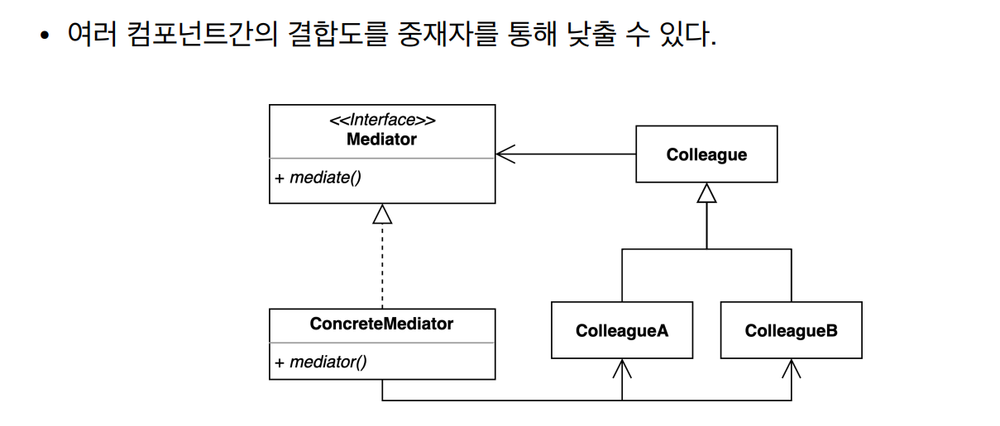
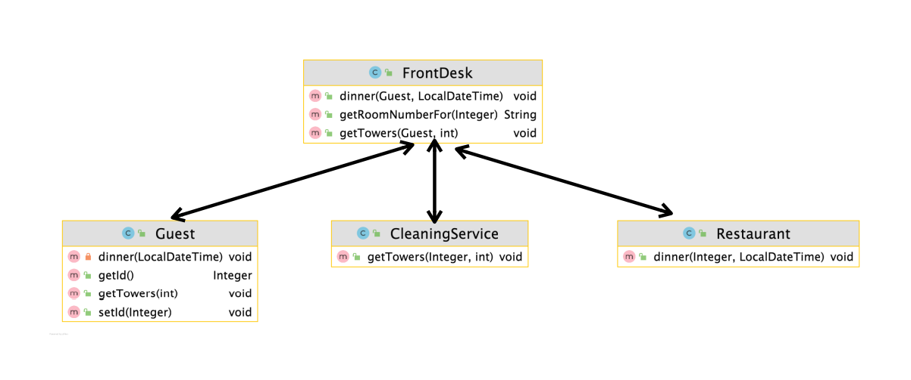
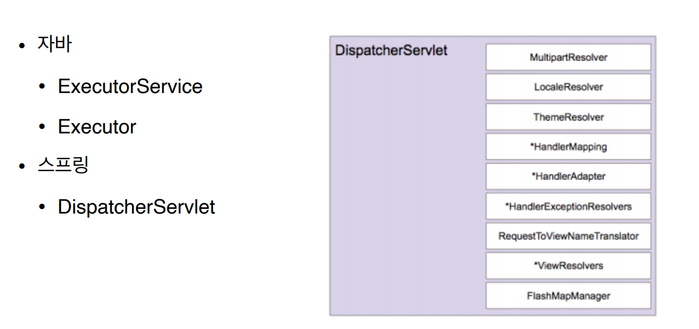

# 중재자패턴

### 중재자패턴

- 여러 객체들이 소통하는 방법을 캡슐화하는 패턴





- 모든 요청을 처리해 주는 Mediator 객체를 넣어준다
    - 그림상에서 Mediator 객체는 FrontDesk 이다
- Mediator 객체는 모든 Component에 대한 의존성이 생겨도 된다
- 항상 위 그림과 같은 형태를 유지하는 것은 아니다. 경우에 따라 ColleageA, ColleagueB가 직접 Mediator를 참조하는 것도 가능하다
    - Guest, CleaningService, Restarurant가 각각의 Colleague에 해당 한다
    

```java
public class FrontDesk {

    private CleaningService cleaningService = new CleaningService();

    private Restaurant restaurant = new Restaurant();

    public void getTowers(Guest guest, int numberOfTowers) {
        cleaningService.getTowers(guest.getId(), numberOfTowers);
    }

    public String getRoomNumberFor(Integer guestId) {
        return "1111";
    }

    public void dinner(Guest guest, LocalDateTime dateTime) {
        restaurant.dinner(guest.getId(), dateTime);
    }
}
```

```java
public class CleaningService {

    private FrontDesk frontDesk = new FrontDesk();

    public void getTowers(Integer guestId, int numberOfTowers) {
        String roomNumber = this.frontDesk.getRoomNumberFor(guestId);
        System.out.println("provide " + numberOfTowers + " to " + roomNumber);
    }
}
```

```java
public class Guest {

    private Integer id;

    private FrontDesk frontDesk = new FrontDesk();

    public void getTowers(int numberOfTowers) {
        this.frontDesk.getTowers(this, numberOfTowers);
    }

    private void dinner(LocalDateTime dateTime) {
        this.frontDesk.dinner(this, dateTime);
    }

    public Integer getId() {
        return id;
    }

    public void setId(Integer id) {
        this.id = id;
    }
}
```

```java
public class Restaurant {
    public void dinner(Integer id, LocalDateTime dateTime) {

    }
}
```

- 모든 요청은 FrontDesk Mediator 중재자 객체를 통해 처리된다

### 중재자패턴 장단점

- 장점
    - 컴포넌트 코드를 변경하지 않고 새로운 중재자를 만들어 사용할 수 있다
    - 각각의 컴포넌트 코드를 보다 간결하게 유지할 수 있다
- 단점
    - 중재자 역할을 하는 클래스의 복잡도와 결합도가 증가한다

### 중재자 패턴의 실무 적용

