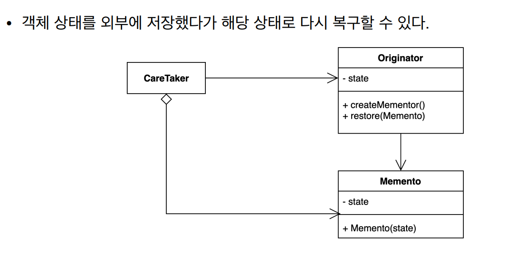

# 메멘토 패턴

### 메멘토패턴

- 캡슐화를 유지하면서 객체 내부 상태를 외부에 저장하는 방법
- 객체 상태를 외부에 저장했다가 해당 상태로 다시 복구할 수 있다
- 객체 내부의 상태를 외부에 노출하지 않고 Mementor Type을 가지고 처리한다




```java
public class Client {

    public static void main(String[] args) {
        Game game = new Game();
        game.setBlueTeamScore(10);
        game.setRedTeamScore(20);

        GameSave save = game.save();

        game.setBlueTeamScore(12);
        game.setRedTeamScore(22);

        game.restore(save);

        System.out.println(game.getBlueTeamScore());
        System.out.println(game.getRedTeamScore());
    }
}
```

```java
public final class GameSave {

    private final int blueTeamScore;

    private final int redTeamScore;

    public GameSave(int blueTeamScore, int redTeamScore) {
        this.blueTeamScore = blueTeamScore;
        this.redTeamScore = redTeamScore;
    }

    public int getBlueTeamScore() {
        return blueTeamScore;
    }

    public int getRedTeamScore() {
        return redTeamScore;
    }
}
```

```java
public class Game {

    private int redTeamScore;

    private int blueTeamScore;

    public int getRedTeamScore() {
        return redTeamScore;
    }

    public void setRedTeamScore(int redTeamScore) {
        this.redTeamScore = redTeamScore;
    }

    public int getBlueTeamScore() {
        return blueTeamScore;
    }

    public void setBlueTeamScore(int blueTeamScore) {
        this.blueTeamScore = blueTeamScore;
    }

    public GameSave save() {
        return new GameSave(this.blueTeamScore, this.redTeamScore);
    }

    public void restore(GameSave gameSave) {
        this.blueTeamScore = gameSave.getBlueTeamScore();
        this.redTeamScore = gameSave.getRedTeamScore();
    }
}
```

- GameService는 Memento Pattern의 역할을 한다
- Mementor Pattern은 Immutable한 Object이다
- 객체 내부의 상태를 밖에 Detail하게 노출하지는 않는다
    - 즉, 캡슐화의 원칙을 지킨다

---

### 메멘토패턴의 장단점

**장점**

- 캡슐화를 지키면서 상태 객체 상태 스냅샷을 만들 수 있다
- 객체 상태 저장하고 또는 복원하는 역할을 CareTaker에게 위임할 수 있다
- 객체 상태가 바뀌어도 클라이언트 코드는 변경되지 않는다

**단점**

- 많은 정보를 저장하는 Mementor를 자주 생성하는 경우 메모리 사용량에 많은 영향을 줄 수 있다

---

### 메멘토 패턴의 실무 적용

- 자바
    - 객체 직렬화, java.io.Serializable
    - java.util.Date