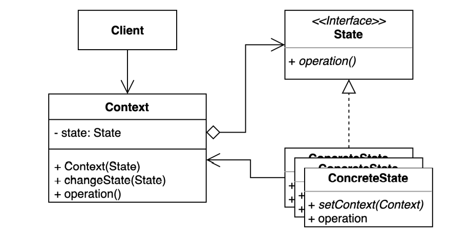
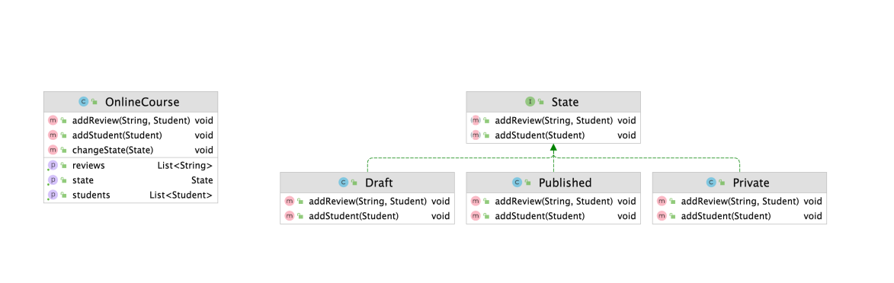

# 상태패턴

### 상태(State) 패턴

- 객체 내부 상태 변경에 따라 객체의 행동이 달라지는 패턴
- 상태에 특화된 행동들을 분리해 낼 수 있으며, 새로운 행동을 추가하더라도 다른 행동에 영향을 주지 않는다





- Client

```java
public class Client {

    public static void main(String[] args) {
        OnlineCourse onlineCourse = new OnlineCourse();
        Student student = new Student("whiteship");
        Student keesun = new Student("keesun");
        keesun.addPrivate(onlineCourse);

        onlineCourse.addStudent(student);

        onlineCourse.changeState(new Private(onlineCourse));

        onlineCourse.addReview("hello", student);

        onlineCourse.addStudent(keesun);

        System.out.println(onlineCourse.getState());
        System.out.println(onlineCourse.getReviews());
        System.out.println(onlineCourse.getStudents());
    }
}
```

- OnlineCourse

```java
public class OnlineCourse {

    private State state = new Draft(this);

    private List<Student> students = new ArrayList<>();

    private List<String> reviews = new ArrayList<>();

    public void addStudent(Student student) {
        this.state.addStudent(student);
    }

    public void addReview(String review, Student student) {
        this.state.addReview(review, student);
    }

    public State getState() {
        return state;
    }

    public List<Student> getStudents() {
        return students;
    }

    public List<String> getReviews() {
        return reviews;
    }

    public void changeState(State state) {
        this.state = state;
    }
}
```

- State

```java
public interface State {

    void addReview(String review, Student student);

    void addStudent(Student student);
}
```

- ConcreteState

```java
public class Private implements State {

    private OnlineCourse onlineCourse;

    public Private(OnlineCourse onlineCourse) {
        this.onlineCourse = onlineCourse;
    }

    @Override
    public void addReview(String review, Student student) {
        if (this.onlineCourse.getStudents().contains(student)) {
            this.onlineCourse.getReviews().add(review);
        } else {
            throw new UnsupportedOperationException("프라이빗 코스를 수강하는 학생만 리뷰를 남길 수 있습니다.");
        }
    }

    @Override
    public void addStudent(Student student) {
        if (student.isAvailable(this.onlineCourse)) {
            this.onlineCourse.getStudents().add(student);
        } else {
            throw new UnsupportedOperationException("프라이빛 코스를 수강할 수 없습니다.");
        }
    }
}
```

```java
public class Published implements State {

    private OnlineCourse onlineCourse;

    public Published(OnlineCourse onlineCourse) {
        this.onlineCourse = onlineCourse;
    }

    @Override
    public void addReview(String review, Student student) {
        this.onlineCourse.getReviews().add(review);
    }

    @Override
    public void addStudent(Student student) {
        this.onlineCourse.getStudents().add(student);
    }
}
```

```java
public class Draft implements State {

    private OnlineCourse onlineCourse;

    public Draft(OnlineCourse onlineCourse) {
        this.onlineCourse = onlineCourse;
    }

    @Override
    public void addReview(String review, Student student) {
        throw new UnsupportedOperationException("드래프트 상태에서는 리뷰를 남길 수 없습니다.");
    }

    @Override
    public void addStudent(Student student) {
        this.onlineCourse.getStudents().add(student);
        if (this.onlineCourse.getStudents().size() > 1) {
            this.onlineCourse.changeState(new Private(this.onlineCourse));
        }
    }
}
```

- 여러개의 상태가 있고 이것을 매번 관리하는 것은 쉽지 않다. 상태패턴을 적용해 여러개의 ConcreteState를 두고 처리한다
- Client에서 상태마다 다르게 동작하도록 호출해 사용한다
- 단, ConcreteState인 클래스들은 Context인 `OnlineCourse.class`를 가지고 있어야 한다

---

### 상태 패턴의 장단점

- 장점
    - 상태에 따른 동작을 개별 클래스로 옮겨서 관리할 수 있다
    - 기존의 특정 상태에 따른 동작을 변경하지 않고 새로운 상태에 다른 동작을 추가할 수 있다
    - 코드 복잡도를 줄일 수 있다
- 단점
    - 복잡도가 증가한다