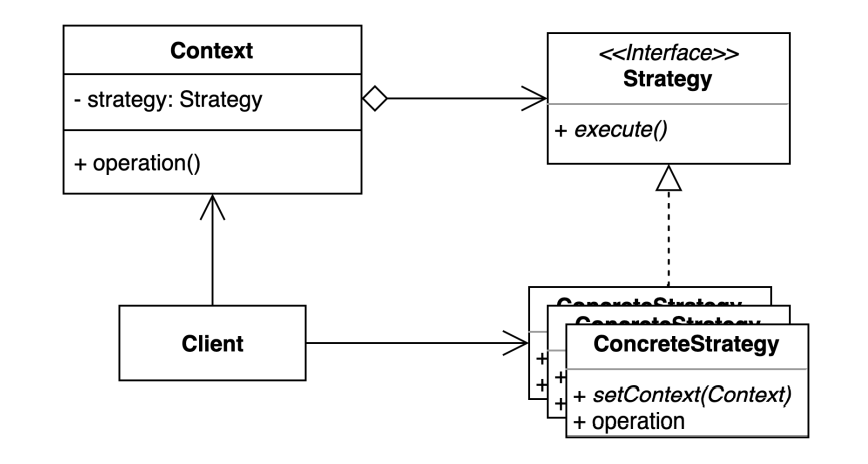
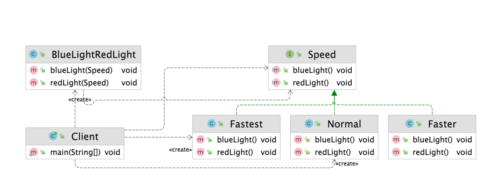

# 전략패턴

### 전략(Streategy) 패턴

- 여러 알고리즘을 캡슐화하고 상호 교환 가능하게 만드는 패턴
    - 특정한 기능을 수행하는데 있어 다양한 알고리즘이 적용될수 있는 경우, 이 다양한 알고리즘을 별도로 분리하는 설계방법
- 일을 수행하는 방법이 여러가지일때 여러 알고리즘을 각각 캡슐화 하고 그 캡슐화 되어있는것은 공통된 인터페이스로 추상화한다
- if-else Pattern을 보통 Strategy Pattern으로 정리해 사용한다
- 자주 나오고 중요한 패턴이기 때문에 유의해서 기억하면 좋다



- Context에서 사용할 알고리즘을 클라이언트에서 선택한다

> 예를 들어 공격기능과 이동 기능이 있는 Robot이 있다면 두 개의 기능(알고리즘이) 각각 캡슐화 되어 Atom Robot에서는 미사일 발사, TaekwonV에서는 레이저 발사와 같이 정의할 수 있음
> 



- BlueLightRedLight

```java
public class BlueLightRedLight {

    public void blueLight(Speed speed) {
        speed.blueLight();
    }

    public void redLight(Speed speed) {
        speed.redLight();
    }
}9
```

- Speed

```java
public interface Speed {

    void blueLight();

    void redLight();

}
```

- blueLight(), redLight() 메소드가 각각의 알고리즘 기능에 해당한다
    - 이를 encapsulation 한다

- Normal

```java
public class Normal implements Speed {
    @Override
    public void blueLight() {
        System.out.println("무 궁 화    꽃   이");
    }

    @Override
    public void redLight() {
        System.out.println("피 었 습 니  다.");
    }
}
```

- Faster

```java
public class Faster implements Speed {
    @Override
    public void blueLight() {
        System.out.println("무궁화꽃이");
    }

    @Override
    public void redLight() {
        System.out.println("피었습니다.");
    }
}
```

- Fastest

```java
public class Fastest implements Speed{
    @Override
    public void blueLight() {
        System.out.println("무광꼬치");
    }

    @Override
    public void redLight() {
        System.out.println("피어씀다.");
    }
}
```

- Client

```java
public class Client {

    public static void main(String[] args) {
        BlueLightRedLight game = new BlueLightRedLight();
        game.blueLight(new Normal());
        game.redLight(new Fastest());
        game.blueLight(new Speed() {
            @Override
            public void blueLight() {
                System.out.println("blue light");
            }

            @Override
            public void redLight() {
                System.out.println("red light");
            }
        });
    }
}
```

- 클라이언트 입장에서 어떠한 전략으로 시작할지를 결정한다
- Context는 그대로 두고 전략을 생성해 넣을 수 있는 구조로 처리 한다

---

### 전략 패턴의 장단점

- 장점
    - 새로운 전략을 추가하더라도 기존 코드를 변경하지 않는다
    - 상속 대신 위임을 사용할 수 있다
    - 런타임에 전략을 변경할 수 있다
- 단점
    - 복잡도가 증가한다
    - 클라이언트 코드가 구체적인 전략을 알아야 한다

---

### 전략 패턴의 실무 적용

- 자바
    - Comparator
- Spring
    - ApplicationContext
    - PlatformTransactionManager