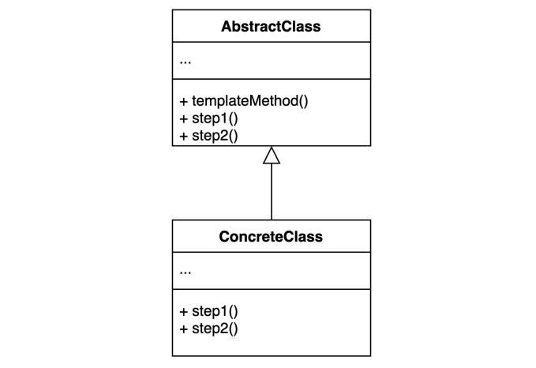
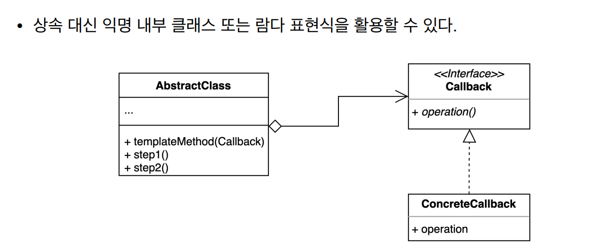
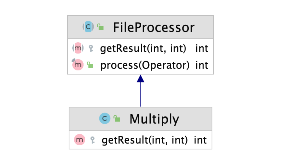

# 템플릿 메소드 패턴

### 템플릿 메소드(Template method) 패턴

- 알고리즘 구조를 서브 클래스가 확장할 수 있도록 템플릿으로 제공하는 방법
- 추상 클래스는 템플릿을 제공하고 하위 클래스는 구체적인 알고리즘을 제공한다







- FileProcessor

```java
public abstract class FileProcessor {

    private String path;
    public FileProcessor(String path) {
        this.path = path;
    }

    public final int process(Operator operator) {
        try(BufferedReader reader = new BufferedReader(new FileReader(path))) {
            int result = 0;
            String line = null;
            while((line = reader.readLine()) != null) {
                result = getResult(result, Integer.parseInt(line));
            }
            return result;
        } catch (IOException e) {
            throw new IllegalArgumentException(path + "에 해당하는 파일이 없습니다.", e);
        }
    }

    protected abstract int getResult(int result, int number);

}
```

- Multiply

```java
public class Multiply extends FileProcessor {
    public Multiply(String path) {
        super(path);
    }

    @Override
    protected int getResult(int result, int number) {
        return result *= number;
    }

}
```

- ConcreteClass인 `Multiply.class` , AbstractClass인 `FileProcessor.class` 가 적용된 템플릿 메소드 패턴이다
- getResult에 대한 구체적인 정의를 Multiply에서 구현한다

---

- Operator

```java
public interface Operator {

    abstract int getResult(int result, int number);
}
```

- Plus

```java
public class Plus implements Operator {
    @Override
    public int getResult(int result, int number) {
        return result += number;
    }
}
```

- Client

```java
public class Client {

    public static void main(String[] args) {
        FileProcessor fileProcessor = new Multiply("number.txt");
        int result = fileProcessor.process((sum, number) -> sum += number);
        System.out.println(result);
    }
}
```

- Client 시점에서 lambda Expression or 익명 내부클래스를 사용하면 상속을 만들지 않고 처리가 가능하다
- 이와 같은 패턴은 템플릿 콜백 패턴이다

[템플릿 콜백 패턴 (Template Callback Pattern)](https://velog.io/@devsh/%ED%85%9C%ED%94%8C%EB%A6%BF-%EC%BD%9C%EB%B0%B1-%ED%8C%A8%ED%84%B4-Template-Callback-Pattern)

---

### 템플릿 메소드 패턴의 장단점

- 장점
    - 템플릿 코드를 재사용하고 중복 코드를 줄일 수 있다
    - 템플릿 코드를 변경하지 않고 상속을 받아서 구체적인 알고리즘만 변경할 수 있다
- 단점
    - 리스코프 치환 원칙을 위반할 수도 있다
    - 알고리즘 구조가 복잡할 수록 템플릿을 유지하기 어려워진다

---

### 템플릿 메소드의 실무적용

- 자바
    - HttpServlet
- 스프링
    - 템플릿 메소드 패턴
        - Configuration
    - 템플릿 콜백 패턴
        - JdbcTemplate
        - RestTemplate