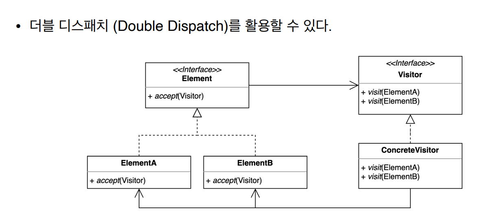

# 방문자 패턴

### 방문자 (Visitor) 패턴

- 기존 코드를 변경하지 않고 새로운 기능을 추가하는 방법
- Solid의 OCP 원칙을 지키는 개념



- *디스패치란?*
    - 어떤 메소드를 호출한 것인지 결정하는 과정

- Client

```java
public class Client {

    public static void main(String[] args) {
        Shape rectangle = new Rectangle();
        Device device = new Pad();
        rectangle.accept(device);
    }
}
```

---

### Visitor

- Device

```java
public interface Device {
    void print(Circle circle);

    void print(Rectangle rectangle);

    void print(Triangle triangle);
}
```

- Watch

```java
public class Watch implements Device {
    @Override
    public void print(Circle circle) {
        System.out.println("Print Circle to Watch");
    }

    @Override
    public void print(Rectangle rectangle) {
        System.out.println("Print Rectangle to Watch");
    }

    @Override
    public void print(Triangle triangle) {
        System.out.println("Print Triangle to Watch");
    }
}
```

- Pad

```java
public class Pad implements Device {
    @Override
    public void print(Circle circle) {
        System.out.println("Print Circle to Pad");
    }

    @Override
    public void print(Rectangle rectangle) {
        System.out.println("Print Rectangle to Pad");
    }

    @Override
    public void print(Triangle triangle) {
        System.out.println("Print Triangle to Pad");
    }
}
```

---

### Element

- Shape

```java
public interface Shape {

    void accept(Device device);

}
```

- Triangle

```java
public class Triangle implements Shape {

    @Override
    public void accept(Device device) {
        device.print(this);
    }
}
```

- Rectangle

```java
public class Rectangle implements Shape {

    @Override
    public void accept(Device device) {
        device.print(this);
    }
}
```

- Circle

```java
public class Circle implements Shape {

    @Override
    public void accept(Device device) {
        device.print(this);
    }
}
```

***더블 디스패치가 일어난다!***

1. 처음에 Shape Interface내부에 accept 메소드를 통해 들어간다
2. 구현 class (Rectangle,Circle,Triangle)에서 자신의 인스턴스를 담는다
3. 이후에 Device Interface안에 print 메소드를 호출한다
4. 메소드 오버로딩에서 각각의 인스턴스에 맞는 메소드를 수행하게 된다
- 메소드 오버로딩은 컴파일마다 static하게 mapping이 되고, 이름이 전혀 다른 메소드랑 차이가 없다고 볼 수 있다

---

### 방문자 패턴의 장단점

- 장점
    - 기존 코드를 변경하지 않고 새로운 코드를 추가할 수 있다
    - 추가 기능을 한 곳에 모아둘 수 있다
- 단점
    - 복잡하다
    - 새로운 Element를 추가하거나 제거할 때 모든 Visitor 코드를 변경해야 한다

---

### 방문자 패턴

- 자바
    - FileVisitor, SimpleFileVisitor
    - AnnotationValueVisitor
    - ElementVisitor
- 스프링
    - BeanDefinitionVisitor