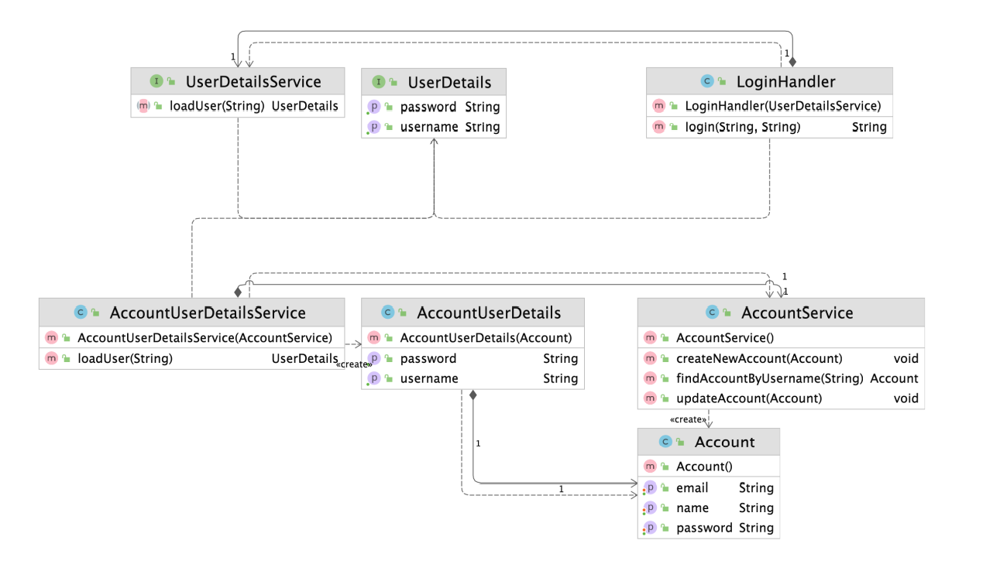

### 어댑터(Adapter) 패턴

- 기존 코드를 클라이언트가 사용하는 인터페이스의 구현체로 바꿔주는 패턴
    - 클라이언트가 사용하는 인터페이스를 따르지 않는 기존 코드를 재사용할 수 있게 해준다



- UserDetail, UserDetailService 는 클라이언트 인터페이스이다

```jsx
class AccountUserDetailService implements UserDetailService {

}

class AccountUserDetails implements UserDetails {

}
```

> AccountUserDetailsService
>

> AccountUserDetails
>
- UserDetailService, UserDetails의 클라이언트 인터페이스를 implement 받아 구현화 시켜 사용한다
- 즉, 타겟 인터페이스를 구현해 사용한다

### 어댑터 패턴의 장단점

**장점**

- 기존 코드를 변경하지 않고 원하는 인터페이스 구현체를 만들어 재사용할 수 있다
- 기존 코드가 하던 일과 특정 인터페이스 구현체로 변환하는 작업을 각기 다른 클래스로 분리하여 관리할 수 있다

**단점**

- 새 클래스가 생겨 복잡도가 증가할 수 있다. 경우에 따라서는 기존 코드가 해당 인터페이스를 구현하도록 수정하는 것이 좋은 선택이 될 수도 있다

### 어댑터 패턴 실무 적용

- 자바
    - java.util.Arrays
    - java.util.Collections
    - java.io.InputStreamReader
    - java.io.OutputStreamReader
- 스프링
    - HandlerAdapter : 우리가 작성하는 다양한 형태의 핸들러 코드를 스프링 MVC가 실행할 수 있는 형태로 변환해주는 어댑터용 인터페이스