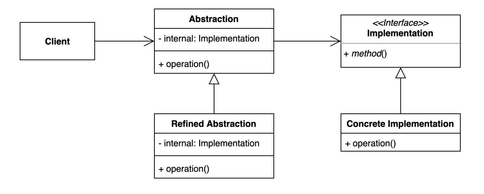
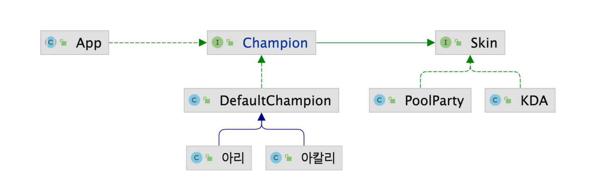

### 브릿지 (Bridge) 패턴

- 추상적인 것과 구체적인 것을 분리하여 연결하는 패턴
    - 하나의 계층 구조일 때 보다 각기 나누었을 때 독립적인 계층 구조로 발전 시킬 수 있다
    - 추상적인 것과 구체적인 것을 분리해서 연결한다
- 클라이언트는 추상적인 객체 구조만 사용





- 구조를 위 그림과 같이 bridge 할 수 있는 형태로 만들어 KDA아리, KDA아칼리, PoolParty 아리... 이런식으로 클래스가 계속 늘어나는것을 방지할 수 있다

```java
// 아리, 아칼리의 class 형태
public class 아리 extends DefaultChampion {
	public 아리(Skin skin) {
		super(skin, "아리")
	}
}

// Abstraction
public interface Champion extends Skin {

    void move();

    void skillQ();

    void skillW();

    void skillE();

    void skillR();

}

// DefaultChampion에 Refined Abstraction 정의 
public class DefaultChampion implements Champion {

    private Skin skin;

    private String name;

    public DefaultChampion(Skin skin, String name) {
        this.skin = skin;
        this.name = name;
    }

    @Override
    public void move() {
        System.out.printf("%s %s move\n", skin.getName(), this.name);
    }

    @Override
    public void skillQ() {
        System.out.printf("%s %s Q\n", skin.getName(), this.name);
    }

    @Override
    public void skillW() {
        System.out.printf("%s %s W\n", skin.getName(), this.name);
    }

    @Override
    public void skillE() {
        System.out.printf("%s %s E\n", skin.getName(), this.name);
    }

    @Override
    public void skillR() {
        System.out.printf("%s %s R\n", skin.getName(), this.name);
    }

    @Override
    public String getName() {
        return null;
    }
}
```

```java
// Implementation 정의
public interface Skin {
    String getName();
}

// Concrete Implementation
public class KDA implements Skin{
    @Override
    public String getName() {
        return "KDA";
    }
}
```

### 브릿지패턴의 장단점

- 장점
    - 추상적인 코드를 구체적인 코드 변경 없이도 독립적으로 확장할 수 있다
    - 추상적인 코드와 구체적인 코드를 분리할 수 있다
- 단점
    - 계층 구조가 늘어나 복잡도가 증가할 수 있다

### 브릿지 패턴 실무적용

- 자바
    - JDBC API, DriverManager와 Driver
    - SLF4J , 로깅 퍼사드와 로거
- 스프링
    - Portable Service Abstraction