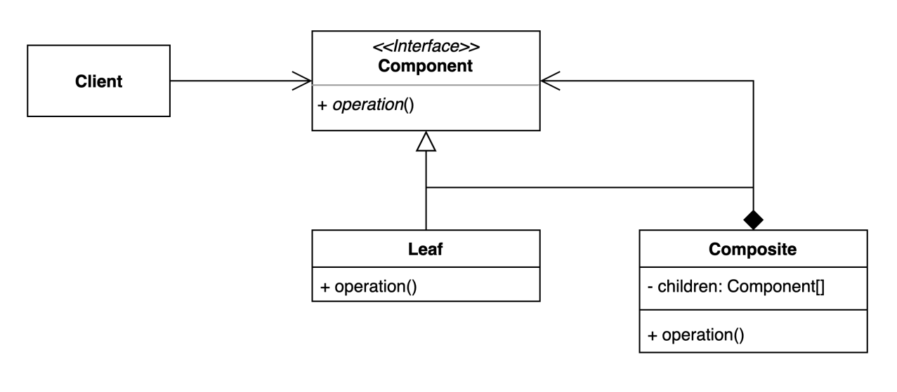
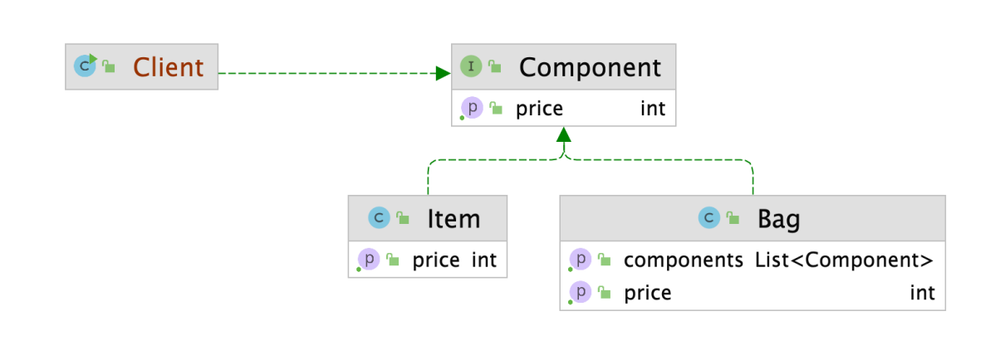

# 컴포짓 디자인 패턴

### 컴포짓 (Composite) 패턴

- 그룹 전체와 개별 객체를 동일하게 처리할 수 있는 패턴
- 클라이언트 입장에서는 ‘전체’ 나 ‘부분’ 이나 동일한 컴포넌트로 인식할 수 있는 계층구조로 만든다



- 유의해야 할 점은 Composite에 구현 된 children 체계는 상위 타입인 Component 타입이여야 한다



- Bag Class의 components list가 `Component` 타입임을 볼 수 있다

> Component가 클라이언트 코드 영역에서 구체적인 타입을 볼 필요가 없고, 단순히 Component 인터페이스만 호출하고 구체적인 구현은 Composit에서 구현한다
>

```java
public interface Component {

    int getPrice();

}

// Bag Class는 Component 
public class Bag implements Component {

    private List<Component> components = new ArrayList<>();

    public void add(Component component) {
        components.add(component);
    }

    public List<Component> getComponents() {
        return components;
    }

    @Override
    public int getPrice() {
        return components.stream().mapToInt(Component::getPrice).sum();
    }
}
```

```java
public class Client {

    public static void main(String[] args) {
        Item doranBlade = new Item("도란검", 450);
        Item healPotion = new Item("체력 물약", 50);

        Bag bag = new Bag();
        bag.add(doranBlade);
        bag.add(healPotion);

        Client client = new Client();
        client.printPrice(doranBlade);
        client.printPrice(bag);
    }

    private void printPrice(Component component) {
        System.out.println(component.getPrice());
    }

}
```

- Client는 Component 클래스만 바라보고 Composite 클래스는 Component 클래스를 implement 받아 구체적인 구현 메소드를 정의 한다

> OCP 원칙에 해당하기 때문에 확장에는 열려있고 변화에는 닫혀있는 구조이다
>

### 컴포짓 패턴의 장단점

- 그룹 전체와 개별 객체를 동일하게 처리할 수 있는 패턴
- 장점
    - 복잡한 트리 구조를 편리하게 사용할 수 있다
    - 다형성과 재귀를 활용할 수 있다
    - 클라이언트 코드를 변경하지 않고 새로운 엘리먼트 타입을 추가할 수 있다
- 단점
    - 트리를 만들어야 하기 때문에 (공통된 인터페이스를 정의해야 하기 때문에) 지나치게 일반화 해야 하는 경우도 생길 수 있다

---

### 컴포짓 패턴의 실무 적용

- 자바
    - Swing 라이브러리
    - JSF 라이브러리