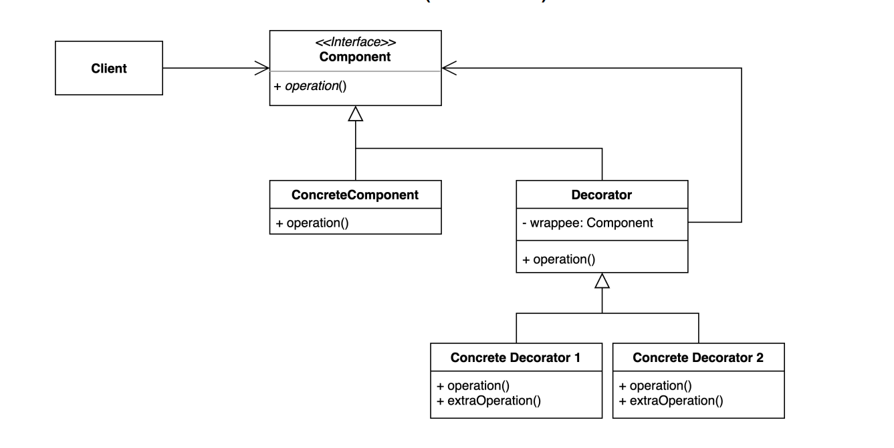
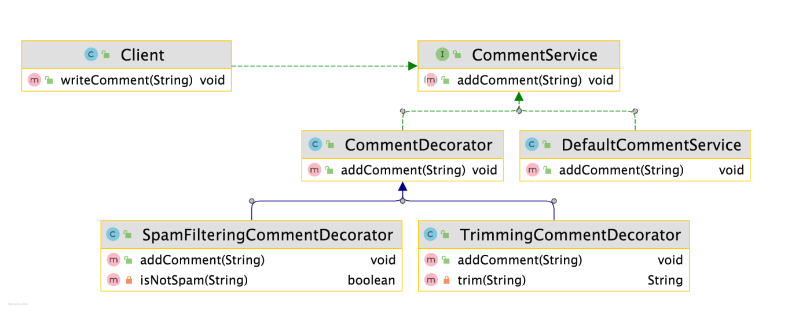

# 데코레이터 패턴

### 데코레이터 패턴

> 기존 코드를 변경하지 않고 부가 기능을 추가하는 패턴
>
- 상속이 아닌 위임을 사용해서 보다 유연하게 런타임 시점에 부가 기능을 추가하는 것도 가능하다





- Concrete Decorator
  - SpamFilteringCommentDecorator
  - TrimmingCommentDecorator
- Decorator
  - CommentDecorator
- Component
  - CommentService

```java
public class Client {

	  private CommentService commentService;

    public Client(CommentService commentService) {
        this.commentService = commentService;
    }

    public void writeComment(String comment) {
        commentService.addComment(comment);
    }

}
```

- Client class 에서는 가장 상위 클래스인 Component에 해당하는 CommentService 타입을 받는다

```java
public class CommentDecorator implements CommentService {

    private CommentService commentService;

    public CommentDecorator(CommentService commentService) {
        this.commentService = commentService;
    }

    @Override
    public void addComment(String comment) {
        commentService.addComment(comment);
    }
}
```

- CommentDecorator는 CommentService를 구현하고, 상위 클래스인 CommentService 타입을 내부에 지닌다
  - Decorator 영역에 해당한다
  - 감싸서 호출하는 부분에 해당한다

```java
public class SpamFilteringCommentDecorator extends CommentDecorator {

    public SpamFilteringCommentDecorator(CommentService commentService) {
        super(commentService);
    }

    @Override
    public void addComment(String comment) {
        if (isNotSpam(comment)) {
            super.addComment(comment);
        }
    }

    private boolean isNotSpam(String comment) {
        return !comment.contains("http");
    }
}
```

```java
public class TrimmingCommentDecorator extends CommentDecorator {

    public TrimmingCommentDecorator(CommentService commentService) {
        super(commentService);
    }

    @Override
    public void addComment(String comment) {
        super.addComment(trim(comment));
    }

    private String trim(String comment) {
        return comment.replace("...", "");
    }
}
```

- Concrete Decorator에 해당하는 `SpamFilteringCommentDecorator`, `TrimmingCommentDecorator` 는CommentDecorator를 상속받아 구현하고 추가적으로 private한 method를 지닌다

> Type이 CommentService 이기만 하면 확장하여 사용할 수 있다. 또한 또다른 데코레이터를 만들 필요가 없고 각자 자기의 역할만한다!
>
> - 이는 SOLID 원칙 중 단일책임원칙에 해당한다

```java
public class App {

    private static boolean enabledSpamFilter = true;

    private static boolean enabledTrimming = true;

    public static void main(String[] args) {
        CommentService commentService = new DefaultCommentService();

        if (enabledSpamFilter) {
            commentService = new SpamFilteringCommentDecorator(commentService);
        }

        if (enabledTrimming) {
            commentService = new TrimmingCommentDecorator(commentService);
        }

        Client client = new Client(commentService);
        client.writeComment("오징어게임");
        client.writeComment("보는게 하는거 보다 재밌을 수가 없지...");
        client.writeComment("http://whiteship.me");
    }
}
```

### 데코레이터 패턴의 장단점

**장점**

- 새로운 클래스를 만들지 않고 기존 기능을 조합할 수 있다
- 컴파일 타임이 아닌 런타임에 동적으로 기능을 변경할 수 있다

**단점**

- 데코레이터를 조합하는 코드가 복잡할 수 있다
  - 그러나 클래스가 계속해서 생성되는 구조가 아니기 때문에 오히려 추가되는 클래스가 많아질 경우 이는 단점에 해당하지 않는다

---

### 데코레이터 패턴의 실무

- 자바
  - InputStream, OutputStream, Reader, Writer의 생성자를 활용한 랩퍼
  - java.util.Collections가 제공하는 메소드를 활용한 랩퍼
  - javax.servlet.http.HttpServletRequest/ResponseWrapper
- 스프링
  - ServletHttpRequestDecorator