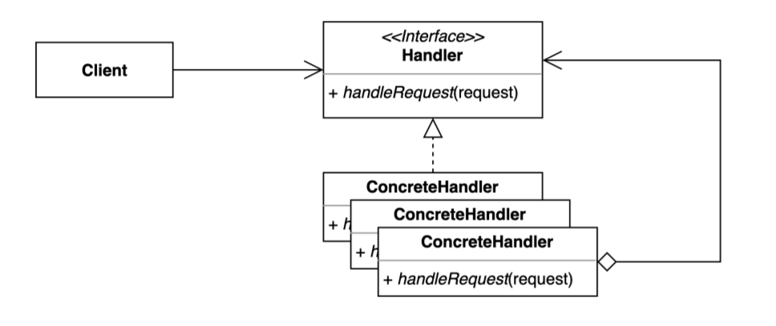

# behavioral_patterns

## 책임 연쇄 패턴

- 요청을 보내는 쪽(sender)과 처리하는 쪽(receiver)을 분리하는 패턴
  


### 예시
- 웹 프로그램
```java
public class Client {

    public static void main(String[] args) {
        Request request = new Request("무궁화 꽃이 피었습니다.");
        RequestHandler requestHandler = new LoggingRequestHandler(); // 클라이언트가 필요한 기능에 따라 핸들러를 알아야 함
        requestHandler.handler(request);
    }
}

public class LoggingRequestHandler extends RequestHandler {

    @Override
    public void handler(Request request) {
        System.out.println("로깅");
        super.handler(request);
    }
}
public class LoggingRequestHandler extends RequestHandler {

    @Override
    public void handler(Request request) {
        System.out.println("로깅");
        super.handler(request);
    }
}
```
▼
```java
public abstract class RequestHandler {

    private RequestHandler nextHandler;

    public RequestHandler(RequestHandler nextHandler) {
        this.nextHandler = nextHandler;
    }

    public void handle(Request request) {
        if (nextHandler != null) {
            nextHandler.handle(request);
        }
    }
}
public class AuthRequestHandler extends RequestHandler {

    public AuthRequestHandler(RequestHandler nextHandler) {
        super(nextHandler);
    }

    @Override
    public void handle(Request request) {
        System.out.println("인증이 되었는가?");
        super.handle(request);
    }
}
public class LoggingRequestHandler extends RequestHandler {

    public LoggingRequestHandler(RequestHandler nextHandler) {
        super(nextHandler);
    }

    @Override
    public void handle(Request request) {
        System.out.println("로깅");
        super.handle(request);
    }
}
public class Client {

    private RequestHandler requestHandler;

    public Client(RequestHandler requestHandler) {
        this.requestHandler = requestHandler;
    }

    public void doWork() {
        Request request = new Request("이번 놀이는 뽑기입니다.");
        requestHandler.handle(request);
    }

    public static void main(String[] args) {
        RequestHandler chain = new AuthRequestHandler(new LoggingRequestHandler(new PrintRequestHandler(null)));
        Client client = new Client(chain);
        client.doWork();
    }
}
```

### 장점
- 클라이언트 코드를 변경하지 않고 새로운 기능을 추가할 수 있음 → 개방폐쇄원칙, 단일책임원칙
- 다양한 형태로 체인을 구성할 수 있음
    - 순서를 지닌 체인, 특정한 핸들러에서만 수행하는 체인
    
### 단점
- 디버깅이 복잡해짐 (모든 체인을 지나가므로)
