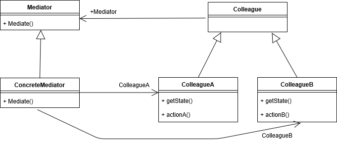

# behavioral_patterns

## 중재자 패턴

- 여러 객체들 간 의사소통 방법을 추상화시켜, 결합도를 낮추는 방법
    - ex) 아파트에서 관리사무소를 통해 주민들간 의사소통을 수행함
    - 결합도가 높을 경우 코드를 구현하기도, 변경하기도, 테스트하기도, 재사용하기도 어려움


- Colleague 끼리는 서로 결합되어 있지 않게 함
- 위 UML 은 하나의 예시일 뿐이고, 인터페이스를 사용하지 않을 수도 있음

### 예시
- 호텔 프로그램
```java
public class CleaningService {
    public void clean(Gym gym) {
        System.out.println("clean " + gym);
    }

    public void getTower(Guest guest, int numberOfTower) {
        System.out.println(numberOfTower + " towers to " + guest);
    }

    public void clean(Restaurant restaurant) {
        System.out.println("clean " + restaurant);
    }
}
public class Guest {

    private Restaurant restaurant = new Restaurant();

    private CleaningService cleaningService = new CleaningService();

    public void dinner() {
        restaurant.dinner(this);
    }

    public void getTower(int numberOfTower) {
        cleaningService.getTower(this, numberOfTower);
    }

}
public class Gym {

    private CleaningService cleaningService;

    public void clean() {
        cleaningService.clean(this);
    }
}
public class Restaurant {

    private CleaningService cleaningService = new CleaningService();
    public void dinner(Guest guest) {
        System.out.println("dinner " + guest);
    }

    public void clean() {
        cleaningService.clean(this);
    }
}
public class Hotel {

    public static void main(String[] args) {
        Guest guest = new Guest();
        guest.getTower(3);
        guest.dinner();

        Restaurant restaurant = new Restaurant();
        restaurant.clean();
    }
}

```
▼
```java
public class CleaningService {

    private FrontDesk frontDesk = new FrontDesk(); // 중재자

    public void getTowers(Integer guestId, int numberOfTowers) {
        String roomNumber = this.frontDesk.getRoomNumberFor(guestId); // 여기서 Guest 정보를 필요로 하면 안됨 (최소한의 정보만 넘겨주기)
        System.out.println("provide " + numberOfTowers + " to " + roomNumber);
    }
}

public class FrontDesk {

    private CleaningService cleaningService = new CleaningService();

    private Restaurant restaurant = new Restaurant();

    public void getTowers(Guest guest, int numberOfTowers) {
        cleaningService.getTowers(guest.getId(), numberOfTowers);
    }

    public String getRoomNumberFor(Integer guestId) {
        return "1111";
    }

    public void dinner(Guest guest, LocalDateTime dateTime) {
        restaurant.dinner(guest.getId(), dateTime);
    }
}
public class Guest {

    private Integer id;

    private FrontDesk frontDesk = new FrontDesk();

    public void getTowers(int numberOfTowers) {
        this.frontDesk.getTowers(this, numberOfTowers);
    }

    private void dinner(LocalDateTime dateTime) {
        this.frontDesk.dinner(this, dateTime);
    }

    public Integer getId() {
        return id;
    }

    public void setId(Integer id) {
        this.id = id;
    }
}
```

### 장점
- 각각의 컴포넌트 코드를 변경하지 않고 새로운 중재자를 구현할 수 있음
    - 인터페이스를 사용해야 가능 (위 예시는 클래스만을 사용하므로 코드의 변경이 일어남)
- 각각의 colleague 들의 코드가 간결해짐
    - 모두 FrontDesk 만 바라보면 되기 때문
    - ex) 연예인과 매니저의 관계

### 단점
- 어플리케이션의 모든 복잡성과 의존도가 한 곳으로 몰리게 됨

### 자바와 스프링에서의 예시
- 자바
    - ExecutorService / Executor (Runnable / Future 를 메세지로 보고, 위임한다고 생각하면 일종의 중재자로 볼 수 있음)
- 스프링
    - DispatcherServlet
        - HandlerMapping, HandlerAdapter 들을 모두 지니고 있음 (단방향 연결성을 지님)
