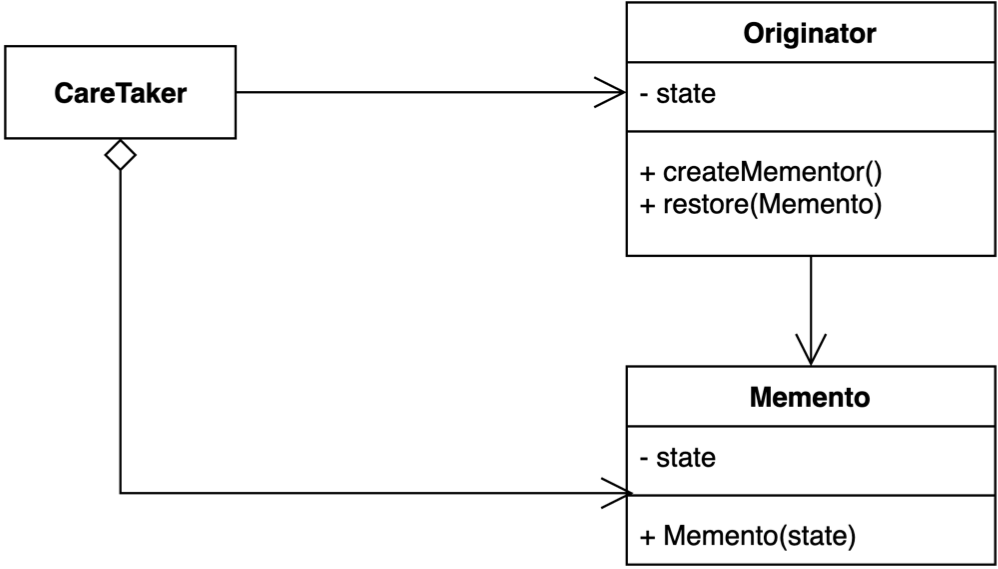

# behavioral_patterns

## 메멘토 패턴

- 객체 내부의 상태를 외부에 저장해 놓고, 복원하고 싶을 때 사용하는 패턴
    - 단, 캡슐화를 유지한 상태에서 저장 (객체 내부의 상태를 모두 공개하지 않은 상태에서 저장) 
    - ex) 에디터의 undo 기능, 게임의 정지 / 저장 기능
    

- Originator : 저장하고 싶은 객체 
- Memento : Originator 내부정보를 추상화하는 객체 (Immutable 객체) 
- CareTaker : Originator 를 복원하는 객체

### 예시
- 게임 프로그램
```java
public class Game implements Serializable { // Originator 객체

    private int redTeamScore;

    private int blueTeamScore;

    public int getRedTeamScore() {
        return redTeamScore;
    }

    public void setRedTeamScore(int redTeamScore) {
        this.redTeamScore = redTeamScore;
    }

    public int getBlueTeamScore() {
        return blueTeamScore;
    }

    public void setBlueTeamScore(int blueTeamScore) {
        this.blueTeamScore = blueTeamScore;
    }
}

public class Client {

    public static void main(String[] args) {
        Game game = new Game();
        game.setRedTeamScore(10);
        game.setBlueTeamScore(20);

        int blueTeamScore = game.getBlueTeamScore();  // 클라이언트가 Game 객체의 내부 정보를 모두 알고 있어야하는 코드
        int redTeamScore = game.getRedTeamScore();

        Game restoredGame = new Game();
        restoredGame.setBlueTeamScore(blueTeamScore);
        restoredGame.setRedTeamScore(redTeamScore);
    }
}
```
▼
```java
public final class GameSave { // 메멘토 객체

    private final int blueTeamScore;

    private final int redTeamScore;

    public GameSave(int blueTeamScore, int redTeamScore) {
        this.blueTeamScore = blueTeamScore;
        this.redTeamScore = redTeamScore;
    }

    public int getBlueTeamScore() {
        return blueTeamScore;
    }

    public int getRedTeamScore() {
        return redTeamScore;
    }
}

public class Game {

    private int redTeamScore;

    private int blueTeamScore;

    // ...

    public GameSave save() { // 메멘토를 이용해 저장 / 복원하는 기능 제공
        return new GameSave(this.blueTeamScore, this.redTeamScore);
    }

    public void restore(GameSave gameSave) {
        this.blueTeamScore = gameSave.getBlueTeamScore();
        this.redTeamScore = gameSave.getRedTeamScore();
    }

}

public class Client { // CareTaker 를 별도로 이용하지 않았음

    public static void main(String[] args) {
        Game game = new Game();
        game.setBlueTeamScore(10);
        game.setRedTeamScore(20);

        GameSave save = game.save(); // Originator 에서 메멘토를 이용해 제공하는 저장 / 복원 이용

        game.setBlueTeamScore(12);
        game.setRedTeamScore(22);

        game.restore(save);

        System.out.println(game.getBlueTeamScore());
        System.out.println(game.getRedTeamScore());
    }
}
```

### 장점
- 객체 내부의 상태를 노출시키지 않고도, 스냅샷을 생성할 수 있음
    - 객체 내부 코드가 변경되어도 클라이언트 코드가 변경될 필요가 없음
- CareTaker 객체를 통해 저장 / 복원 기능을 수행함 → 단일책임 원칙
    
### 단점
- 메멘토 객체가 크고, 자주 사용한다면 메모리 사용량에 영향을 줌
    - CareTaker 에서 오래된 메멘토 객체를 정리하는 역할을 수행해줘야 함

### 자바에서의 예시
- 자바
    - Date 클래스
        - long 타입을 그대로 사용한다는 점에서 애매하지만, 메멘토 패턴으로 볼 수 있음 
    - 직렬화, 역직렬화 (Serializable 인터페이스)
        ```java
        // 직렬화
        try(FileOutputStream fileOut = new FileOutputStream("GameSave.hex");
        ObjectOutputStream out = new ObjectOutputStream(fileOut))
        {
            out.writeObject(game);
        }

        game.setBlueTeamScore(25);
        game.setRedTeamScore(15);
        // 역직렬화
        try(FileInputStream fileIn = new FileInputStream("GameSave.hex");
            ObjectInputStream in = new ObjectInputStream(fileIn))
        {
            game = (Game) in.readObject();
            System.out.println(game.getBlueTeamScore());
            System.out.println(game.getRedTeamScore());
        }
        ```
        - 보안 문제가 발생할 수 있음 (Save 파일을 직접 조작)
        - 직렬화 / 역직렬화를 사용할 경우 성능, 각종 기능들을 더 찾아보고 쓰면 좋음
