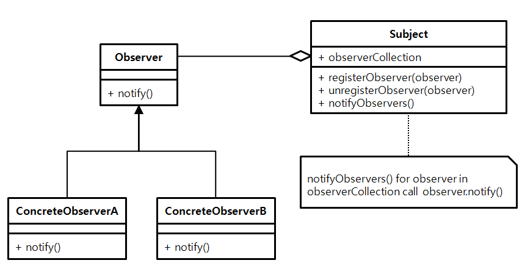

# behavioral_patterns

## 옵저버 패턴

- 어떤 것을 감지하고 상태의 변경을 지켜보는 패턴
    - 여러개의 객체들이 특정한 상태 변화에 따라 반응해야 할 때 사용
    - 본 패턴을 통해 Pub/Sub 패턴을 쉽게 구현할 수 있음

- AS-IS : 폴링 메커니즘 (주기적으로 메세지를 가져와야 함)
    - 비용이 비쌈


- Subject : 여러 옵저버를 등록하거나 해지할 수 있는 기능 제공. 상태 변경 시 자신에게 등록된 옵저버를 순회하며 특정 메서드를 호출해줌. 
- Observer : 호출될 메서드를 정하는 객체
    - 자바에서는 인터페이스 없이도 리플렉션을 이용해 구현할 수 있음

### 예시
- 채팅 프로그램
```java
public class Client {

    public static void main(String[] args) {
        ChatServer chatServer = new ChatServer();

        User user1 = new User(chatServer);
        user1.sendMessage("디자인패턴", "이번엔 옵저버 패턴입니다.");
        user1.sendMessage("롤드컵2021", "LCK 화이팅!");

        User user2 = new User(chatServer);
        System.out.println(user2.getMessage("디자인패턴")); // 일일이 데이터를 폴링해야함

        user1.sendMessage("디자인패턴", "예제 코드 보는 중..");
        System.out.println(user2.getMessage("디자인패턴"));
    }
}
```
▼
```java
public class User implements Subscriber { // Concrete 옵저버

    private String name;

    public User(String name) {
        this.name = name;
    }

    public String getName() {
        return name;
    }

    @Override
    public void handleMessage(String message) {
        System.out.println(message);
    }
}

public class ChatServer { // Subject 객체

    private Map<String, List<Subscriber>> subscribers = new HashMap<>();

    public void register(String subject, Subscriber subscriber) { // 구독하는 기능 제공
        if (this.subscribers.containsKey(subject)) {
            this.subscribers.get(subject).add(subscriber);
        } else {
            List<Subscriber> list = new ArrayList<>();
            list.add(subscriber);
            this.subscribers.put(subject, list);
        }
    }

    public void unregister(String subject, Subscriber subscriber) { // 해지하는 기능 제공
        if (this.subscribers.containsKey(subject)) {
            this.subscribers.get(subject).remove(subscriber);
        }
    }

    public void sendMessage(User user, String subject, String message) { // 이벤트 발생 시 옵저버들의 메서드 호출
        if (this.subscribers.containsKey(subject)) {
            String userMessage = user.getName() + ": " + message;
            this.subscribers.get(subject).forEach(s -> s.handleMessage(userMessage));
        }
    }

}

public class Client {

    public static void main(String[] args) {
        ChatServer chatServer = new ChatServer();
        User user1 = new User("keesun");
        User user2 = new User("whiteship");

        chatServer.register("오징어게임", user1);
        chatServer.register("오징어게임", user2);

        chatServer.register("디자인패턴", user1);

        chatServer.sendMessage(user1, "오징어게임", "아.. 이름이 기억났어.. 일남이야.. 오일남"); // 클라이언트에서 직접적으로 폴링 할 필요 없음
        chatServer.sendMessage(user2, "디자인패턴", "옵저버 패턴으로 만든 채팅");

        chatServer.unregister("디자인패턴", user2);

        chatServer.sendMessage(user2, "디자인패턴", "옵저버 패턴 장, 단점 보는 중");
    }
}
```

### 장점
- 상태를 변경하는 객체와, 변경을 감지하는 객체의 관계를 느슨하게 할 수 있음
- Subject 의 상태를 주기적으로 조회하지 않아도 됨
- 런타임 중 새로운 옵저버 객체를 추가, 해제할 수 있음
    
### 단점
- 오브젝트 등록, 해제 작업 → 복잡도 증가
- 등록 후 해지를 안하는 경우 가비지가 됨 → 메모리 누수
    - 해결책
        1. 적절한 순간에 반드시 해지해 주어야 함
        2. WeakReference 적용 (명시적으로 해지가 안될 경우에만 사용)

### 자바와 스프링에서의 예시
- 자바
    - Observer 인터페이스 / Observable 클래스 (Deprecated)
        ```java
        static class Subject extends Observable {
            public void add(String message) {
                setChanged(); // 해당 함수를 호출하지 않으면 알림을 받을 수 없음
                notifyObservers(message);
            }
        }
        ```
        - 알림을 받는 순서를 예측 할 수 없음
        - 한 번의 상태 변경에 여러번 Notification 할 수 없음
    - PropertyChangeListener
        - 토픽을 설정 할 수 있음
        - 알람을 받는 우선순위도 둘 수 있음
    - Flow API (Java 9 도입)
        - SubmissionPublisher 이용 비동기 처리 가능 
        - 처리량을 조절하여 BackPressure 를 조정 할 수 있음
    - RxJava
    - Reactor
- 스프링
    - ApplicationContext (이벤트 Publisher)
        - ApplicationEventPublisher, ApplicationListener
