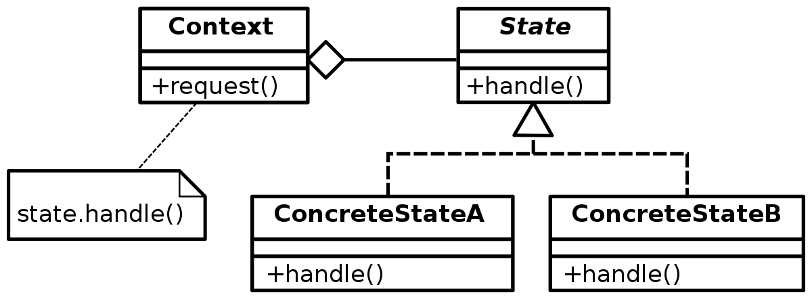

# behavioral_patterns

## 상태 패턴

- 특정한 상태에 따라 행동이 달라지는 객체들을 위한 패턴
    - ex) 리모컨 : 동일한 버튼도 TV의 상태에 따라 동작이 달라짐 (TV가 켜져있을 때 / 꺼져 있을 때)
    - ex) 포스트를 쓸 때 : Draft 상태, 공개 상태 등 



- Context : 상태 변경을 관리. 상태와 관련된 행위는 State 로 위임. (추가로, 상태와 관계 없는 고유의 정보들을 담음). 
- State : 상태에 따라 달라지는 행위

### 예시
- 글 쓰기 프로그램
```java
public class OnlineCourse {

    public enum State {
        DRAFT, PUBLISHED, PRIVATE
    }

    private State state = State.DRAFT;
    private List<String> reviews = new ArrayList<>();
    private List<Student> students = new ArrayList<>();

    public void addReview(String review, Student student) {
        if (this.state == State.PUBLISHED) {
            this.reviews.add(review);
        } else if (this.state == State.PRIVATE && this.students.contains(student)) {
            this.reviews.add(review);
        } else {
            throw new UnsupportedOperationException("리뷰를 작성할 수 없습니다.");
        }
    }

    public void addStudent(Student student) {
        if (this.state == State.DRAFT || this.state == State.PUBLISHED) {
            this.students.add(student);
        } else if (this.state == State.PRIVATE && availableTo(student)) {
            this.students.add(student);
        } else {
            throw new UnsupportedOperationException("학생을 해당 수업에 추가할 수 없습니다.");
        }

        if (this.students.size() > 1) {
            this.state = State.PRIVATE;
        }
    }
    // ...
}

```
▼
```java
public class OnlineCourse { // Context 클래스

    private State state = new Draft(this);

    private List<Student> students = new ArrayList<>();

    private List<String> reviews = new ArrayList<>();

    public void addStudent(Student student) {
        this.state.addStudent(student);
    }

    public void addReview(String review, Student student) {
        this.state.addReview(review, student);
    }
    // ...
}
```
```java
public interface State { // State 인터페이스

    void addReview(String review, Student student);

    void addStudent(Student student);
}
```
```java
public class Private implements State { // Concrete State 클래스

    private OnlineCourse onlineCourse;

    public Private(OnlineCourse onlineCourse) {
        this.onlineCourse = onlineCourse;
    }

    @Override
    public void addReview(String review, Student student) {
        if (this.onlineCourse.getStudents().contains(student)) {
            this.onlineCourse.getReviews().add(review);
        } else {
            throw new UnsupportedOperationException("프라이빗 코스를 수강하는 학생만 리뷰를 남길 수 있습니다.");
        }
    }

    @Override
    public void addStudent(Student student) {
        if (student.isAvailable(this.onlineCourse)) {
            this.onlineCourse.getStudents().add(student);
        } else {
            throw new UnsupportedOperationException("프라이빛 코스를 수강할 수 없습니다.");
        }
    }
}
public class Draft implements State {

    private OnlineCourse onlineCourse;

    public Draft(OnlineCourse onlineCourse) {
        this.onlineCourse = onlineCourse;
    }

    @Override
    public void addReview(String review, Student student) {
        throw new UnsupportedOperationException("드래프트 상태에서는 리뷰를 남길 수 없습니다.");
    }

    @Override
    public void addStudent(Student student) {
        this.onlineCourse.getStudents().add(student);
        if (this.onlineCourse.getStudents().size() > 1) {
            this.onlineCourse.changeState(new Private(this.onlineCourse));
        }
    }
}
```

### 장점
- 한 곳에 뭉쳐 있던(if-else) 상태에 따른 동작을 개별적인 클래스로 옮겨 담을 수 있음 (가장 큰 장점!) 
- 기존의 상태에 따른 동작을 변경하지 않고 새로운 상태에 다른 동작을 추가할 수 있음
- 코드 복잡도를 줄일 수 있음
    
### 단점
- 상태가 단순하다면 오버 엔지니어링이 될 수 있음
