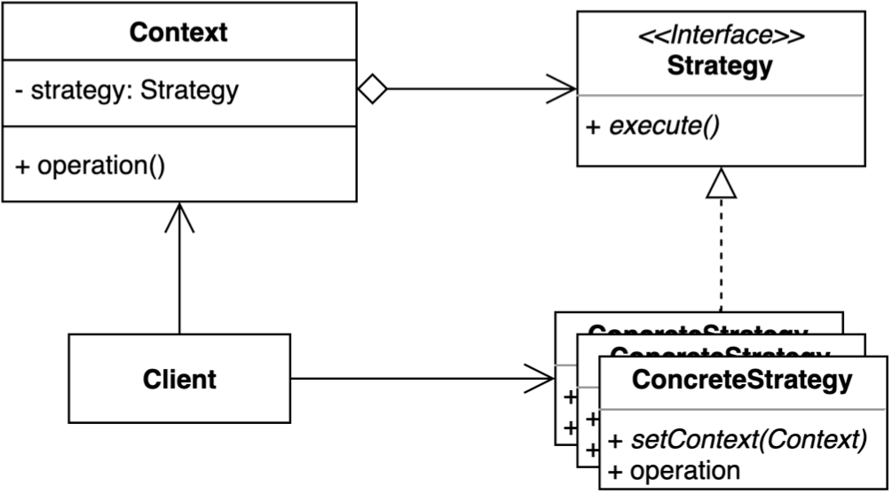

# behavioral_patterns

## 전략 패턴

- 어떤 일을 수행하는 방법이 여러가지 일 때, 해당 알고리즘을 캡슐화하고 공통된 인터페이스로 추상화하여 해당 알고리즘을 변경할 수 있게끔 하는 방법
    - ex) 자바의 Comparable 인터페이스


- Context : 알고리즘을 Strategy 인터페이스로 위임
- Strategy : 각각의 알고리즘을 해당 Strategy 안에서 구현함 

### 예시
- 무궁화 꽃이 피었습니다 프로그램
```java
public class BlueLightRedLight {

    private int speed;

    public BlueLightRedLight(int speed) {
        this.speed = speed;
    }

    public void blueLight() {
        if (speed == 1) {
            System.out.println("무 궁 화    꽃   이");
        } else if (speed == 2) {
            System.out.println("무궁화꽃이");
        } else {
            System.out.println("무광꼬치");
        }

    }

    public void redLight() {
        if (speed == 1) {
            System.out.println("피 었 습 니  다.");
        } else if (speed == 2) {
            System.out.println("피었습니다.");
        } else {
            System.out.println("피어씀다");
        }
    }
}
```
▼
```java
public class BlueLightRedLight { // Context

    public void blueLight(Speed speed) {
        speed.blueLight();
    }

    public void redLight(Speed speed) {
        speed.redLight();
    }
}
```
```java
public interface Speed { // Strategy 인터페이스

    void blueLight();

    void redLight();

}
```
```java
public class Normal implements Speed { // Concrete Strategy 클래스
    @Override
    public void blueLight() {
        System.out.println("무 궁 화    꽃   이");
    }

    @Override
    public void redLight() {
        System.out.println("피 었 습 니  다.");
    }
}

public class Faster implements Speed {
    @Override
    public void blueLight() {
        System.out.println("무궁화꽃이");
    }

    @Override
    public void redLight() {
        System.out.println("피었습니다.");
    }
}
```

### 장점
- 새로운 전략을 추가해도 기존 코드를 변경하지 않음 (개방폐쇄원칙) 
- 상속 대신 위임을 사용할 수 있음
- 런타임 중에 전략을 변경 할 수 있음
    
### 단점
- 클래스가 많아지고 복잡해짐 (but, 한 번만 이용한다면 코드 내부에서 한 번만 구현하면 됨)
- 클라이언트 자체가 구체적인 전략을 알아야함 (의존성 발생)

### 자바와 스프링에서의 예시
- 자바
    - Comparator
        ```java
        public class StrategyInJava {
            public static void main(String[] args) {
                List<Integer> numbers = new ArrayList<>();
                numbers.add(10);
                numbers.add(5);
        
                System.out.println(numbers);
        
                Collections.sort(numbers, Comparator.naturalOrder());
        
                System.out.println(numbers);
            }
        }
        ```
- 스프링
    - ApplicationContext
        - ClassPathXmlApplicationContext, FileSystemXmlApplicationContext, ...
        ```java
        public class StrategyInSpring {
        
            public static void main(String[] args) {
                ApplicationContext applicationContext = new ClassPathXmlApplicationContext();
                ApplicationContext applicationContext1 = new FileSystemXmlApplicationContext();
                ApplicationContext applicationContext2 = new AnnotationConfigApplicationContext();
        
                BeanDefinitionParser parser;
        
                PlatformTransactionManager platformTransactionManager;
        
                CacheManager cacheManager;
            }
        }
        ```
    - BeanDefinitionParser
    - PlatformTransactionManager
    - CacheManager