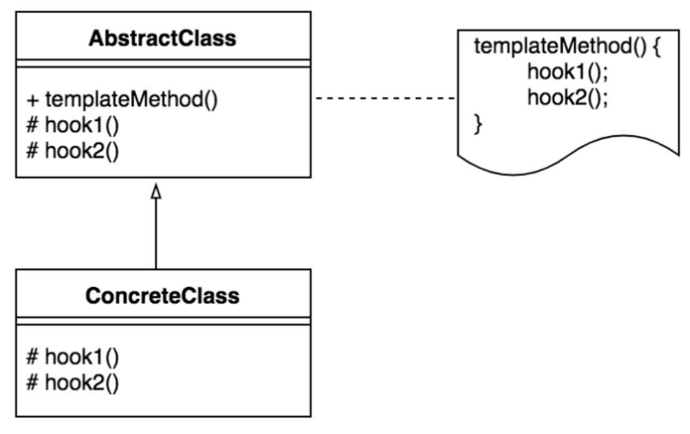
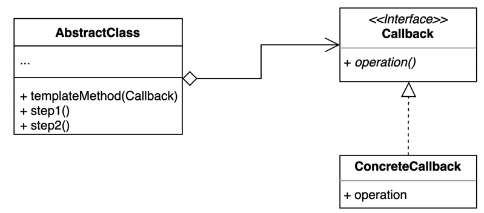

# behavioral_patterns

## 템플릿 메소드 패턴

- 알고리즘의 구조를 템플릿으로 처리하여 각 단계의 구체적인 방법은 서브클래스가 구현하도록 함
    - 상속을 사용
    - Inversion of Control : 제어권이 역전되어 있는 형태 


- AbstractClass
    - templateMethod() : 알고리즘의 구조를 표현한 메서드
    - 알고리즘의 각 단계를 추상 메서드로 분리해둠
- ConcreteClass : 각각의 단계를 구체적으로 구현함


## 템플릿 콜백(Template-Callback) 패턴

- 콜백으로 상속 대신 위임을 사용하는 템플릿 패턴
    - 상속 대신 익명 내부 클래스 혹은 람다 표현식을 활용


    
### 예시
- 파일을 처리하는 프로그램
```java
public class FileProcessor {

    private String path;
    public FileProcessor(String path) {
        this.path = path;
    }

    public int process() {
        try(BufferedReader reader = new BufferedReader(new FileReader(path))) {
            int result = 0;
            String line = null;
            while((line = reader.readLine()) != null) {
                result += Integer.parseInt(line);
            }
            return result;
        } catch (IOException e) {
            throw new IllegalArgumentException(path + "에 해당하는 파일이 없습니다.", e);
        }
    }
}
public class MultiplyFileProcessor { // 상당량의 코드가 중복됨

    private String path;
    public MultuplyFileProcessor(String path) {
        this.path = path;
    }

    public int process() {
        try(BufferedReader reader = new BufferedReader(new FileReader(path))) {
            int result = 0;
            String line = null;
            while((line = reader.readLine()) != null) {
                result *= Integer.parseInt(line);
            }
            return result;
        } catch (IOException e) {
            throw new IllegalArgumentException(path + "에 해당하는 파일이 없습니다.", e);
        }
    }
}
```
▼
1. 상속을 이용한 예시 (템플릿 메서드 패턴)
    ```java
    public abstract class FileProcessor { // AbstractClass
    
        private String path;
        public FileProcessor(String path) {
            this.path = path;
        }
    
        public final int process() {
            try(BufferedReader reader = new BufferedReader(new FileReader(path))) {
                int result = 0;
                String line = null;
                while((line = reader.readLine()) != null) {
                    result = getResult(result, Integer.parseInt(line));
                }
                return result;
            } catch (IOException e) {
                throw new IllegalArgumentException(path + "에 해당하는 파일이 없습니다.", e);
            }
        }
    
        protected abstract int getResult(int result, int number); // 추상 메서드
    }
    ```
    ```java
    public class Plus extends FileProcessor {
        public Plus(String path) {
            super(path);
        }
        @Override
        protected int getResult(int result, int number) {
            return result += number;
        }
    }
    ```
2. 인터페이스를 이용한 예시 (템플릿 콜백 패턴)
    ```java
    public class FileProcessor {
    
        private String path;
        public FileProcessor(String path) {
            this.path = path;
        }
    
        public final int process(Operator operator) { // Operator 인터페이스를 이용
            try(BufferedReader reader = new BufferedReader(new FileReader(path))) {
                int result = 0;
                String line = null;
                while((line = reader.readLine()) != null) {
                    result = operator.getResult(result, Integer.parseInt(line));
                }
                return result;
            } catch (IOException e) {
                throw new IllegalArgumentException(path + "에 해당하는 파일이 없습니다.", e);
            }
        }
    }
    ```
    ```java
    public interface Operator {
    
       abstract int getResult(int result, int number);
    }
    ```
    ```java
    public class Plus implements Operator {
        @Override
        public int getResult(int result, int number) {
            return result += number;
        }
    }
    ```
    ```java
    public class Client {
    
        public static void main(String[] args) {
            FileProcessor fileProcessor = new Multiply("number.txt");
            int result = fileProcessor.process((sum, number) -> sum += number); // 람다 이용
            System.out.println(result);
        }
    }
    ```

### 장점
- 템플릿 코드를 재사용하고 중복 코드를 줄일 수 있음 
- 템플릿 코드를 변경하지 않고 상속을 받아 구체적인 알고리즘만 변경할 수 있음
    
### 단점
- 리스코프 치환 원칙을 위반할 가능성이 있음
    - 리스코프 치환 원칙 : 상위 타입 클래스를 임의대로 변경해도 코드가 동작해야함
    - `final` 키워드 등으로 불필요한 Override 를 어느정도 막을 수 있으나, 하위 클래스에서 구현해야 할 Step 들에도 하위 클래스가 의도를 벗어날 가능성이 있음
- 알고리즘 구조가 복잡할 수록 템플릿을 유지하기 어려워짐

### 자바와 스프링에서의 예시
- 자바
    - HttpServlet
        - Servlet Container 엔진이 `doGet`, `doPost` 메서드를 실행해줌 (IoC : 제어의 역전)
        ```java
        public class MyHello extends HttpServlet {
        
          @Override
          protected void doGet(HttpServletRequest req, HttpServletResponse resp) throws ServletException, IOException {
              super.doGet(req, resp);
          }
        
          @Override
          protected void doPost(HttpServletRequest req, HttpServletResponse resp) throws ServletException, IOException {
              super.doPost(req, resp);
          }
        }
        ```
- 스프링
    - ConfigurerAdapter
        ```java
        public class TemplateInSpring {
        
            @Configuration
            class SecurityConfig extends WebSecurityConfigurerAdapter {
        
                @Override
                protected void configure(HttpSecurity http) throws Exception { // Init 이라는 템플릿 메서드의 일부를 구현
                    http.authorizeRequests().anyRequest().permitAll();
                }
            }
        }
        ```
    - JdbcTemplate, RestTemplate
        ```java
        public class TemplateInSpring {
                
            public static void main(String[] args) {
                // TODO 템플릿-콜백 패턴
                // JdbcTemplate
                JdbcTemplate jdbcTemplate = new JdbcTemplate();
                jdbcTemplate.execute("insert");
            
                // RestTemplate
                RestTemplate restTemplate = new RestTemplate();
            
                HttpHeaders headers = new HttpHeaders();
                headers.setAccept(Arrays.asList(MediaType.APPLICATION_JSON));
                headers.set("X-COM-PERSIST", "NO");
                headers.set("X-COM-LOCATION", "USA");
            
                HttpEntity<String> entity = new HttpEntity<String>(headers);
                ResponseEntity<String> responseEntity = restTemplate
                        .exchange("http://localhost:8080/users", HttpMethod.GET, entity, String.class); // Try-Catch-Finally 가 반복되어 등장한다면 패턴 적용을 고려해볼 것
            }    
        }
        ```
