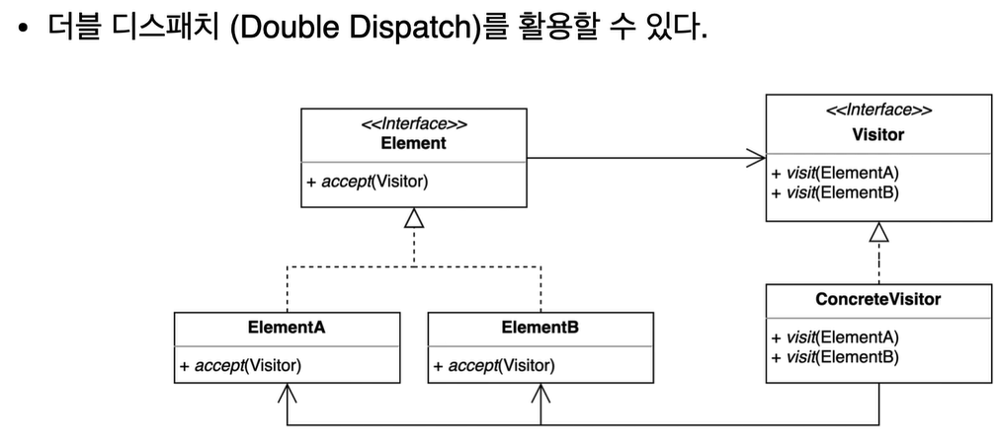

# behavioral_patterns

## 방문자 패턴

- 기존 코드를 수정하지 않고 새로운 기능을 추가
    - SRP, 버그 발생 가능성, 재사용을 위한 대비 등으로 기존 코드를 수정하고 싶지 않을 때 적용
    


- Element : 변하지 않는 본연의 기능만 지니고 있는 클래스
    - `accept()` : 디스패치를 위해 사용하는 장치
- visitor : 추가하고 싶은 로직을 담고 있는 인터페이스. 메서드 오버로딩을 지원 (Element 의 갯수만큼)
- Dispatch : 요청을 위임 하는 것 (다형성 등을 이용해 분배 / 배치하는 것) 

### 예시
- 도형을 기기에 출력하는 프로그램
```java
public class Client {

    public static void main(String[] args) {
        Shape rectangle = new Rectangle();
        Device device = new Phone();
        rectangle.printTo(device);
    }
}
public class Rectangle implements Shape {

    @Override
    public void printTo(Device device) {
        if (device instanceof Phone) {
            System.out.println("print Rectangle to phone");
        } else if (device instanceof Watch) {
            System.out.println("print Rectangle to watch");
        }
    }
}
public class Triangle implements Shape {

    @Override
    public void printTo(Device device) { // Device 가 추가될 때마다 도형의 코드가 변경되어야함
        if (device instanceof Phone) {
            System.out.println("print Triangle to Phone");
        } else if (device instanceof Watch) {
            System.out.println("print Triangle to Watch");
        }
    }

}
public class Phone implements Device{
}
public class Watch implements Device{
}
```
▼
```java
public class Client {

    public static void main(String[] args) {
        Shape rectangle = new Rectangle();
        Device device = new Pad();
        rectangle.accept(device);
    }
}

public interface Shape {
    void accept(Device device); // 디스패치 1
}

public interface Device { // 실행 시 Device 인터페이스를 이용해 정적 매핑이 가능하게 하기 위함 
    void print(Circle circle); // 디스패치 2

    void print(Rectangle rectangle);

    void print(Triangle triangle);
}
```
```java
public class Phone implements Device {
    @Override
    public void print(Circle circle) {
        System.out.println("Print Circle to Phone");
    }

    @Override
    public void print(Rectangle rectangle) {
        System.out.println("Print Rectangle to Phone");
    }

    @Override
    public void print(Triangle triangle) {
        System.out.println("Print Triangle to Phone");
    }
}

public class Watch implements Device {
    @Override
    public void print(Circle circle) {
        System.out.println("Print Circle to Watch");
    }

    @Override
    public void print(Rectangle rectangle) {
        System.out.println("Print Rectangle to Watch");
    }

    @Override
    public void print(Triangle triangle) {
        System.out.println("Print Triangle to Watch");
    }
}
```
```java
public class Circle implements Shape {

    @Override
    public void accept(Device device) {
        device.print(this);
    }
}

public class Rectangle implements Shape {

    @Override
    public void accept(Device device) {
        device.print(this);
    }
}
```

### 장점
- 기존 코드를 수정하지 않고 새로운 코드를 추가할 수 있음
    
### 단점
- 구조가 복잡하여 이해하기 어려움
- element 가 추가되거나 없어지면 변경량이 많아짐

### 자바와 스프링에서의 예시
- 자바
    - FileVisitor, SimpleFileVisitor
        ```java
        public class VisitorInJava {
        
            public static void main(String[] args) throws IOException {
                Path startingDirectory = Path.of("/Users/keesun/workspace/design-patterns");
                SearchFileVisitor searchFileVisitor =
                        new SearchFileVisitor("Triangle.java", startingDirectory);
                Files.walkFileTree(startingDirectory, searchFileVisitor);
            }
        }
        public class SearchFileVisitor implements FileVisitor<Path> {
        
            private String fileToSearch;
            private Path startingDirectory;
        
            public SearchFileVisitor(String fileToSearch, Path startingDirectory) {
                this.fileToSearch = fileToSearch;
                this.startingDirectory = startingDirectory;
            }
        
            @Override
            public FileVisitResult preVisitDirectory(Path dir, BasicFileAttributes attrs) throws IOException {
                return FileVisitResult.CONTINUE;
            }
        
            @Override
            public FileVisitResult visitFile(Path file, BasicFileAttributes attrs) throws IOException {
                if (fileToSearch.equals(file.getFileName().toString())) {
                    System.out.println("found " + file.getFileName());
                    return FileVisitResult.TERMINATE;
                }
                return FileVisitResult.CONTINUE;
            }
        
            @Override
            public FileVisitResult visitFileFailed(Path file, IOException exc) throws IOException {
                exc.printStackTrace(System.out);
                return FileVisitResult.CONTINUE;
            }
        
            @Override
            public FileVisitResult postVisitDirectory(Path dir, IOException exc) throws IOException {
                if (Files.isSameFile(startingDirectory, dir)) {
                    System.out.println("search end");
                    return FileVisitResult.TERMINATE;
                }
                return FileVisitResult.CONTINUE;
            }
        }
        ```
    - AnnotationValueVisitor
    - ElementVisitor
- 스프링
    - BeanDefinitionVisitor
        ```java
        public class VisitorInSpring {
        
            public static void main(String[] args) {
                BeanDefinitionVisitor beanDefinitionVisitor;
            }
        }
        ```