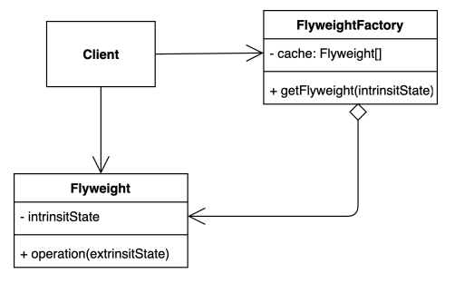

## 플라이 웨이트 패턴 (Flyweight pattern)

### 플라이 웨이트 패턴 정의

- 객체의 자주 변하는 속성(extrinsit)과 자주 변하지 않는 속성(intrinsit)을 분리하고, 자주 변하지 않는 속성을 재사용하여 메모리 사용량을 최적화하는 디자인 패턴이다.



---

### 편집기 애플리케이션의 문자 객체 설계하기

- 다음 코드를 보면 편집기의 문자가 생성될 때마다 각 객체의 문자, 색상, 글씨체, 글씨 크기가 메모리에 할당된다.

```java
public class Client {

    public static void main(String[] args) {
        Character c1 = new Character('h', "white", "Nanum", 12);
        Character c2 = new Character('e', "white", "Nanum", 12);
        Character c3 = new Character('l', "white", "Nanum", 12);
        Character c4 = new Character('l', "white", "Nanum", 12);
        Character c5 = new Character('o', "white", "Nanum", 12);
    }
}
```

---

### 플라이 웨이트 패턴을 이용하여 메모리 최적화하기

- 먼저 플라이 웨이트 패턴을 적용하려면 Character 객체의 extrinsit과 intrinsit을 분리해야 하는데 예제에서는 value와 color를 extrinsit으로 분리하고, fontFamily와 fontSize를 intrinsit으로 분리한다.
- Character 클래스의 프로퍼티인 fontFamily와 fontSize를 모든 Character에서 공유 데이터로 활용하기 위해서 Flyweight에 해당하는 Font 클래스로 묶는다.
- 모든 Character 객체에서 공유하는 Font는 불변하게 설계해야 한다.

```java
@Getter
public class Character {
  private char value;
  private String color;
  private Font font; // Flyweight

  public Character(char value, String color, Font font) {
              this.value = value;
              this.color = color;
              this.font = font;
    }
}

@Getter
public final class Font {
    private final String fontFamily;
    private final int fontSize;

    public Font(String fontFamily, int fontSize) {
        this.fontFamily = fontFamily;
        this.fontSize = fontSize;
    }
}
```

- 다음으로 FlyweightFactory에 해당하는 FontFactory에서 Font를 가져올 때 캐싱된 데이터가 있으면 그대로 반환하고, 없으면 객체를 캐싱한다.

```java
public class FontFactory {

    private final Map<String, Font> cache = new HashMap<>();

    public Font getFont(String font) {
        if (cache.containsKey(font)) {
            return cache.get(font);
        }

        String[] split = font.split(":");
        Font newFont = new Font(split[0], Integer.parseInt(split[1]));
        cache.put(font, newFont);
        return newFont;
    }
}
```

- 클라이언트에서 FontFactory를 이용해서 캐싱된 Font를 공유하여 사용하기 때문에 메모리를 절약할 수 있다.

```java
public class Client {

    public static void main(String[] args) {
        FontFactory fontFactory = new FontFactory();

        Character c1 = new Character('h', "white", fontFactory.getFont("Nanum:12"));
        Character c2 = new Character('e', "white", fontFactory.getFont("Nanum:12"));
        Character c3 = new Character('l', "white", fontFactory.getFont("Nanum:12"));
        Character c4 = new Character('l', "white", fontFactory.getFont("Nanum:12"));
        Character c5 = new Character('o', "white", fontFactory.getFont("Nanum:12"));
    }
}
```

---

### 플라이 웨이트 패턴 장단점

- 장점
  - 애플리케이션에서 사용하는 메모리를 줄일 수 있다.
- 단점
  - 코드의 복잡성이 증가한다.

---

### 자바에서 찾아보는 플라이웨이 패턴

**_Integer.valueOf()_**

- This method will always cache values in the range -128 to 127