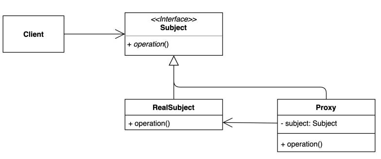

## 프록시 패턴 (Proxy pattern)

### 프록시 패턴 정의

- 특정 객체에 대한 접근을 제어하거나 기능을 추가할 수 있는 패턴이다.
- 초기화 지연, 접근 제어, 로깅, 캐싱 등 다양하게 응용하여 사용할 수 있다.



---

### GameService 클래스에 startGame() 구현

- startGame() 메소드는 간단한 메시지를 프린트하는 주 기능과 주 기능을 실행하는데 걸리는 시간을 계산해서 로깅하는 부가 기능이 구현되어 있다.
- startGame()에는 주 기능만 구현하고 부가 기능은 다른 곳에서 구현해 보자.

```java
public class GameService {

    public void startGame() {
        long before = System.currentTimeMillis(); // 부가 기능

        System.out.println("이 자리에 오신 여려분을 진심으로 환영합니다."); // 주 기능

        System.out.println(System.currentTimeMillis() - before); // 부가 기능
    }
}
```

### 게임의 부가적인 기능을 프록시 패턴으로 개선

- interface GameService
    - 게임 서비스의 인터페이스, 실제 구현체와 Proxy 클래스가 구현한다.
- DefaultGameService
    - 주 기능을 하는 실제 구현체
- GameServiceProxy
    - DefaultGameService 앞에서 실행되며 부가 기능(로깅, 캐싱 등..)을 담당한다.
    - 실제 연산은 DefaultGameService에 위임한다.

```java
public interface GameService {
    void startGame();
}

public class DefaultGameService implements GameService {

    @Override
    public void startGame() {
        System.out.println("이 자리에 오신 여려분을 진심으로 환영합니다.");
    }
}

public class GameServiceProxy implements GameService {

    private GameService gameService;

    @Override
    public void startGame() {
        long before = System.currentTimeMillis();
        if (this.gameService == null) {
            this.gameService = new DefaultGameService();
        }

        gameService.startGame(); // 위임
        System.out.println(System.currentTimeMillis() - before);
    }
}
```

---

### 프록시 패턴의 장단점

- 장점
    - 기존 코드를 변경하지 않으면서 원하는 기능을 추가할 수 있다.
        - Target에 해당하는 DefaultGameService는 변경되지 않는다.
    - 기능 추가 및 지연 초기화 등으로 유연한 설계가 가능하다.
- 단점
    - 코드의 복잡도가 증가한다.

---

### 자바와 스프링에서 찾아보는 프록시 패턴

**_다이나믹 프록시_**

- 자바의 Proxy 클래스를 통해서 런타임에 동적으로 Proxy 패턴을 적용할 수 있다.

```java
public class ProxyInJava {

    public static void main(String[] args) {
        ProxyInJava proxyInJava = new ProxyInJava();
        proxyInJava.dynamicProxy();
    }

    private void dynamicProxy() {
        GameService gameService = getGameServiceProxy(new DefaultGameService());
        gameService.startGame();
    }

    private GameService getGameServiceProxy(GameService target) {
        return (GameService) Proxy.newProxyInstance(
                target.getClass().getClassLoader(),
                new Class[]{GameService.class},
                (proxy, method, args) -> {
                    System.out.println("--before--");
                    method.invoke(target, args);
                    System.out.println("--after--");
                    return null;
                });
    }
}
```