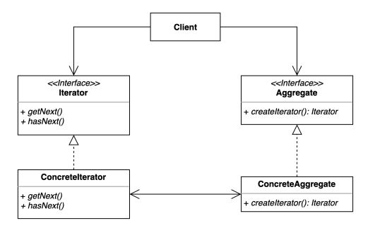

## 이터레이터 패턴 (Iterator pattern)

### 이터레이터 패턴 정의

- 컬렉션 구현 방법을 클라이언트에게 노출시키지 않으면서 그 집합체 안에 들어있는 모든 항목에 대해 접근할 수 있는 방법을 제공한다.
- 집합 객체를 순회하는 클라이언트 코드는 변경하지 않고 다양한 순회 방법을 제공할 수 있다.

---

### 이터레이터 패턴 구조 



---

### 이터레이터 패턴 장단점

- 장점
  - 집합 객체가 가지고 있는 객체들에 손쉽게 접근할 수 있다.
  - 일관된 인터페이스를 사용해 여러 형태의 집합 구조를 순회할 수 있다.
- 단점
  - 클래스가 늘어나고 복잡도가 증가한다.

---

### 자바와 스프링에서 찾아보는 이러테이터 패턴

**_java.util.Enumeration과 java.util.Iterator_**

- Enumberation은 Iterator가 만들어지기 전인 자바 1버전부터 사용되었다.
- 현 시점에는 Enumeration은 거의 사용되지 않고 Iterator를 사용하고, 자바 9 버전부터 Enumeration 인터페이스에 Iterator로 변환하는 메서드가 추가되었다.

**_Java StAX (Streaming API for XML)_**

- XML을 만들거나 읽을 때 사용하는 Java 라이브러리이다.
- 콘솔 기반의 API, 이터레이터 기반의 API 두 가지를 제공한다.

```java
// 이터레이터 기반의 API 예제
public class IteratorInJava {

    public static void main(String[] args) throws FileNotFoundException, XMLStreamException {
        XMLInputFactory xmlInputFactory = XMLInputFactory.newInstance();
        XMLEventReader reader = xmlInputFactory.createXMLEventReader(new FileInputStream("Book.xml"));
        while (reader.hasNext()) {
            XMLEvent nextEvent = reader.nextEvent();
            if (nextEvent.isStartElement()) {
                StartElement startElement = nextEvent.asStartElement();
                QName name = startElement.getName();
                if (name.getLocalPart().equals("book")) {
                    Attribute title = startElement.getAttributeByName(new QName("title"));
                    System.out.println(title.getValue());
                }
            }
        }
    }
}
```