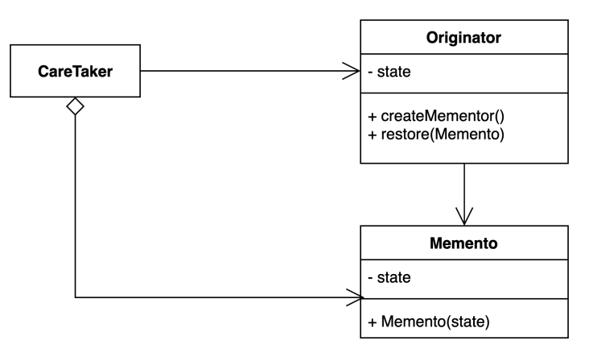

## 메멘토 패턴 (Memento Pattern)

### 정의

- 캡슐화를 유지하면서 객체 내부 상태를 외부에 저장하는 패턴
- 메멘토 패턴을 사용하면 객체 상태를 외부에 저장했다가 해당 상태로 다시 복구할 수 있다.
    - 예) 에디터의 undo 기능, 게임 종료 후 재접속 시 해당 시점부터 플레이
- 캡슐화를 유지하면서 객체의 내부 상태를 외부에 저장하고, 외부에 저장된 데이터를 통해서 해당 상태로 복구하는 특징이 있다.

---

### 설명

- Originator
  - 메멘토 패턴을 적용해서 원래 상태로 복원하려고 하는 기존 객체
  - 자신의 현재 데이터로 Memento를 생성하는 연산과 외부에서 Memento를 주입 받아서 해당 데이터로 복원하는 연산을 한다.
- CareTaker
  - Originator가 생성한 Memento를 저장하고, 가지고 있는 Memento로 Originator를 복원할 수 있는 외부 클래스
- Memento
  - Originator의 내부 정보를 저장하는 추상화된 타입
  - 불변 객체로 정의

--- 

### 장단점

- 장점
  - 캡술화를 지키면서 객체 상태의 스냅샷을 만들 수 있다.
  - 객체 상태를 저장하고 복원하는 역할을 CareTaker에게 위임할 수 있다.
  - 객체 상태가 바뀌어도 클라이언트 코드는 변경되지 않는다.
- 단점
  - 많은 정보를 저장하는 Memento를 자주 생성하는 경우 메모리 사용량에 많은 영향을 줄 수 있다.