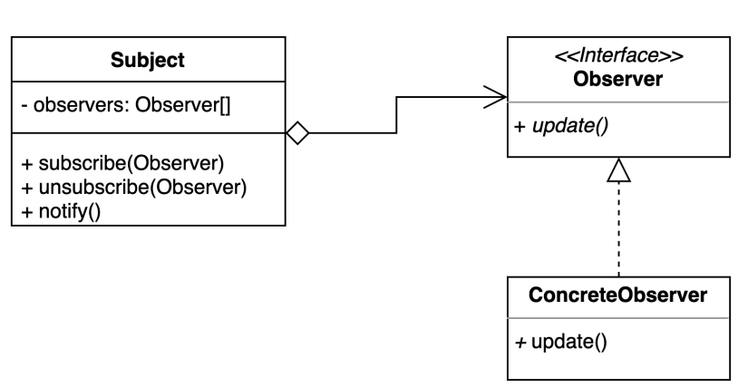

## 옵저버 패턴 (Observer Pattern)

### 정의

- 어떤 변경을 지켜보고 감지하는 패턴
- 여러개의 객체들이 특정한 하나의 상태를 바라보고 해당 상태의 변경을 감지해서 반응을 해야할 때 사용한다.
- 옵저버 패턴을 사용하면 pub/sub 패턴을 구현할 수 있다.

---

### 설명

- Subject
  - 자신에게 여러 Observer들을 등록하거나 해지하는 것이 주요 목적이다.
  - Subject의 특정 상태가 변경이 되면 등록되어 있는 Observer를 순회하면서 Observer가 제공하는 메서드를 호출한다.
- Observer
  - Subject의 상태 변경 시 호출되어야 할 오퍼레이션을 정의한 인터페이스
  - Subject는 Observer 인터페이스를 구현한 인스턴스를 등록할 수 있다.
- ConcreteObserver
  - Observer 인터페이스의 구현체
  - Subject의 특정 상태가 변경되면 호출하는 오퍼레이션을 실제로 실행한다.

---

### 장단점

- 장점
  - 상태를 변경하는 객체(publisher)와 변경을 감지하는 객체(subsriber)의 관계를 느슨하게 유지할 수 있다.
  - Subject의 상태 변경을 주기적으로 조회하지 않고 자동으로 감지할 수 있다.
    - User가 ChatServer에 메세지를 보낼 때 폴링하지 않아도 각각의 User는 자동으로 메세지를 전달받을 수 있다.
  - 런타임에 옵저버를 추가하거나 제거할 수 있다.
- 단점
  - 복잡도가 증가한다.
  - 다수의 Observer 객체를 등록 이후 해지 않는다면 memory leak이 발생할 수도 있다.