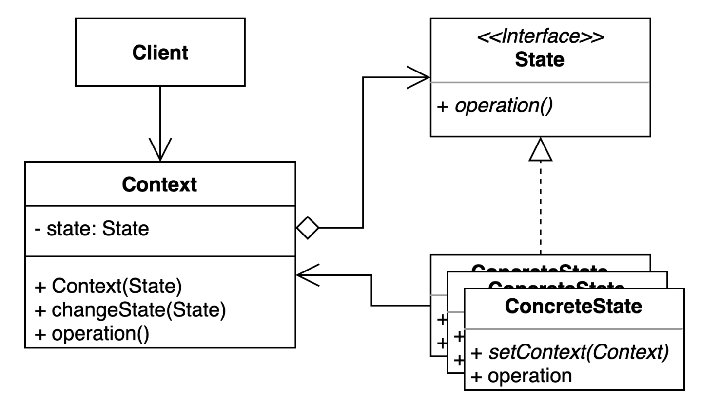
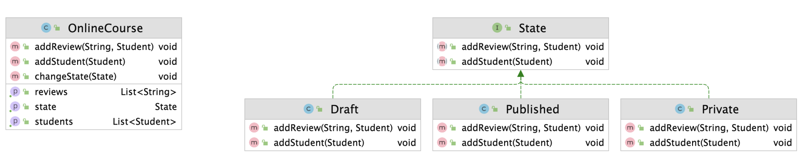

## 상태 패턴 (State Pattern)

### 개념

- 특정한 상태에 따라 행동이 달라지는 객체를 정의하기 위한 패턴
  - ex) TV 전원 버튼은 TV가 켜져 있을 때는 TV를 끄고 꺼져있을 때는 키는데, 버튼을 누르는 동일한 행동이라도 TV의 상태에 따라 내부적으로 행동이 달라진다. 
- 상태에 특화된 행동을 분리할 수 있고, 새로운 행동이 추가되더라도 다른 행동에 영향을 주지 않는다.

---

### 역할



- Context
  - 상태를 가지고 있고, 상태에 따라 행동이 달라져야 하는 객체
  - 상태에 따라 달라지는 행동을 State에게 위임
- State
  - Context 내부적으로 변경될 수 있는 상태의 인터페이스
  - 상태에 따라 달라져야 할 행동에 대한 메소드를 정의
- ConcreteState
  - Context의 구체적인 상태 클래스
  - Context가 해당 상태일 때의 행동을 정의
  - 내부적으로 Context를 참조

---

### 예제

- 상태에 따라 분기되어 다른 행동을 하는 OnlineCourse 객체

```java
public class OnlineCourse {

    private State state;
    private final List<Student> students = new ArrayList<>();
    private final List<String> reviews = new ArrayList<>();

    public void addStudent(Student student) {
        if (this.state.equals(State.DRAFT) || this.state.equals(State.PUBLISHED)) {
            this.students.add(student);
        } else if (this.state.equals(State.PRIVATE) && student.isAvailable(this)) {
            this.students.add(student);
        } else {
            throw new UnsupportedOperationException("학생을 해당 수업에 추가할 수 없습니다.");
        }

        if (this.students.size() > 1) {
            this.state = State.PRIVATE;
        }
    }

  public void addReview(String review, Student student) {
    if (this.state.equals(State.PUBLISHED)) {
            this.reviews.add(review);
        } else if (this.state.equals(State.PRIVATE) && this.students.contains(student)) {
            this.reviews.add(review);
        } else {
            throw new UnsupportedOperationException("드래프트 상태에서는 리뷰를 작성할 수 없습니다.");
        }
    }

}
```

- 상태를 분리하여 OnlineCourse 객체의 상태와 상태 별 행동을 분리한다.
- 상태에 따라 다른 처리를 했던 addStudent와 addReview 메서드를 State에게 위임한다.



```java
public class OnlineCourse {

  private State state;
  private final List<Student> students = new ArrayList<>();
  private final List<String> reviews = new ArrayList<>();

  public OnlineCourse() {
    this.state = new Draft(this);
  }

  public void addStudent(Student student) {
    this.state.addStudent(student);
  }

  public void addReview(String review, Student student) {
    this.state.addReview(review, student);
  }

  public void changeState(State state) {
    this.state = state;
  }
}
```
- 각 상태는 OnlineCourse가 해당 상태일 때 취해야 하는 행동을 정의한다.

```java
public class Draft implements State {

    private final OnlineCourse onlineCourse;

    public Draft(OnlineCourse onlineCourse) {
        this.onlineCourse = onlineCourse;
    }

    @Override
    public void addStudent(Student student) {
        this.onlineCourse.getStudents().add(student);

        if (this.onlineCourse.getStudents().size() > 1) {
            this.onlineCourse.changeState(new Private(this.onlineCourse));
        }
    }

    @Override
    public void addReview(String review, Student student) {
        throw new UnsupportedOperationException("드래프트 상태에서는 리뷰를 추가할 수 없습니다.");
    }
}
```

---

### 장단점

- 장점
  - 하나의 클래스에 뭉쳐져 있던 상태에 따른 동작을 각 상태로 분리할 수 있다.
    - 객체의 분기 처리된 코드를 파악하고 유지보수하기 수월하며, 각 상태별로 단위 테스트를 작성하기 좋은 코드가 된다.
  - 기존의 특정 상태에 따른 동작을 변경하지 않고 새로운 상태의 다른 동작을 추가할 수 있다.
- 단점
  - 클래스가 많아지며 복잡도가 증가한다.