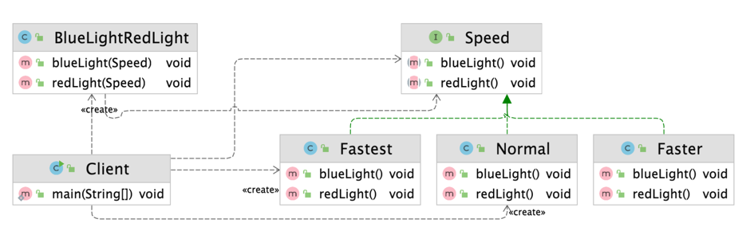
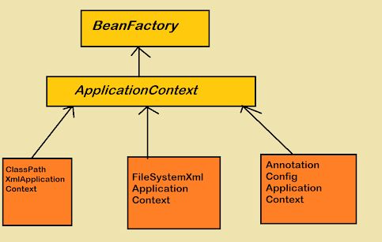

## 전략 패턴 (Strategy Pattern)

### 개념

- 어떤 작업을 수행하는 방법이 여러 가지 일 때 여러 방법에 따라 알고리듬을 각각의 클래스로 캡슐화하고 인터페이스로 추상화하여 해당 작업을 실행시키는 클라이언트에서 필요에 따라 방법을 정하는 패턴

---

### 역할


- Context
  - 작업을 수행하는 클래스
  - Strategy를 Composition하거나 메소드의 파라미터로 받아서 해당 전략으로 작업을 수행
- ConcreteStrategy
  - Strategy의 구현체
  - Context의 작업 수행에 관한 여러 방법의 알고리듬을 캡슐화 한 클래스
  - Client가 Context의 작업을 수행할 때 ConcreteStrategy 인스턴스로 상황에 맞는 방법을 정함
- Strategy
  - Context의 작업 수행에 관한 알고리듬을 추상화한 인터페이스

---

### 예제

- RedLightGreenLight 클래스는 동일한 작업이라도 speed에 따라서 작업 수행 알고리듬이 달라진다.
- speed 값에 따른 다양한 알고리듬을 하나의 클래스에서 관리한다.
  - speed에 관련된 요구 사항이 추가되거나 변경될 경우 RedLightGreenLight 클래스를 변경해야한다.

```java
public class RedLightGreenLight {

    private int speed;

    public RedLightGreenLight(int speed) {
        this.speed = speed;
    }

    public void redLight() {
        if (this.speed == 1) {
            System.out.println("무    궁 화   꽃 이");
        } else if (this.speed == 2) {
            System.out.println("무궁화꽃이");
        } else {
            System.out.println("무광꼬치");
        }
    }

    public void greenLight() {
        if (this.speed == 1) {
            System.out.println("피  었    습 니   다.");
        } else if (this.speed == 2) {
            System.out.println("피었습니다.");
        } else {
            System.out.println("피었씀다.");
        }
    }
}
```

- 위의 코드를 전략 패턴을 적용해서 개선한다.
- speed 값에 따른 각각의 알고리듬을 Speed라는 추상화된 전략 인터페이스를 구현해서 각각의 클래스로 캡슐화 한다.
- RedLightGreenLight 작업을 실행하는 Client는 각 Strategy 구현 클래스로 작업의 수행 방법을 정할 수 있다.



- 개선된 RedLightGreenLight 클래스는 작업을 수행할 때 Speed에게 작업을 위임함으로써 전략에 따라서 다른 알고리듬이 수행될 수 있게 한다.

```java
public class RedLightGreenLight {

    public void redLight(Speed speed) {
        speed.redLight();
    }

    public void greenLight(Speed speed) {
        speed.greenLight();
    }
}
```

- ConcreteStrategy에 해당하는 Fastest 클래스를 보면 자신의 전략에 맞는 알고리듬을 수행한다.

```java
public class Fastest implements Speed {

    @Override
    public void redLight() {
        System.out.println("무광꼬치");
    }

    @Override
    public void greenLight() {
        System.out.println("피어씀다.");
    }
}
```

- Client는 Context에 해당하는 RedLightGreenLight에 대해서 같은 작업을 호출 하더라도 필요에 따라서 다른 전략을 선택해서 로직을 구성할 수 있다.

```java
public class Client {

    public static void main(String[] args) {
        RedLightGreenLight game = new RedLightGreenLight();

        // 각 행동마다 전략 선택 가능
        game.redLight(new Normal());
        game.greenLight(new Fastest());

        // 익명 클래스를 통해 구현 가능
        game.redLight(new Speed() {
            @Override
            public void redLight() {
                System.out.println("redLight");
            }

            @Override
            public void greenLight() {
                System.out.println("greenLight");
            }
        });
    }
}
```

---

### 장단점

- 장점
  - 새로운 전략을 추가하더라도 기존 코드를 변경하지 않는다.
  - 상속 대신에 위임을 사용할 수 있다.
    - 상속은 하나밖에 안되기 때문에 정말 필요한 경우를 대비해서 Composition으로 해결하는게 좋다.
  - 런타임에 전략을 변경할 수 있다.
- 단점
  - 클래스가 많아지고 복잡도가 증가할 수 있다.
    - 일회성의 경우 익명 클래스 구현으로 어느정도 해결할 수 있다.
  - 클라이언트 코드가 구체적인 전략을 알아야 한다.

---

### 자바와 스프링으로 알아보는 전략 패턴

**_Comparator_**
- Java의 대표적인 전략 패턴
- Collection 타입의 여러가지 정렬에 대한 전략 알고리듬을 구현한다.
- 자주 사용되는 미리 정의된 전략이 있고, Comparator 인터페이스 구현 및 익명 클래스로 상황에 맞게 커스텀할 수 있다.

```java
public class StrategyInJava {

    public static void main(String[] args) {
        List<Integer> numbers = new ArrayList<>();
        numbers.add(5);
        numbers.add(10);
        numbers.add(7);

        numbers.sort(Comparator.reverseOrder());
        numbers.sort(Comparator.naturalOrder());
        
        numbers.sort(new Comparator<Integer>() {
            @Override
            public int compare(Integer o1, Integer o2) {
                return o2 - o1;
            }
        });
    }
}
```

**_ApplicationContext_**

- Spring에 사용되는 많은 전략 패턴 중 하나
- Spring Container 역할을 하는 ApplicationContext는 다양한 전략으로 구성될 수 있다.

 

```java
public class StrategyInSpring {

    public static void main(String[] args) {
        // ApplicationContext -> Strategy
        // 각 구현체 -> ConcreteStrategy
        ApplicationContext ctx1 = new ClassPathXmlApplicationContext();
        ApplicationContext ctx2 = new FileSystemXmlApplicationContext();
        ApplicationContext ctx3 = new AnnotationConfigApplicationContext();
    }
}
```