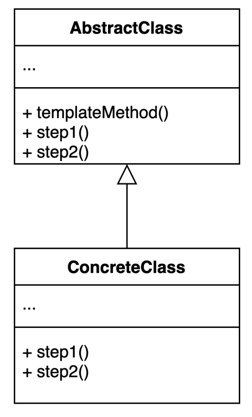
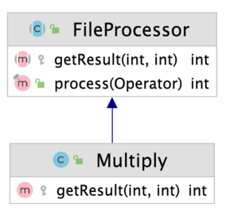
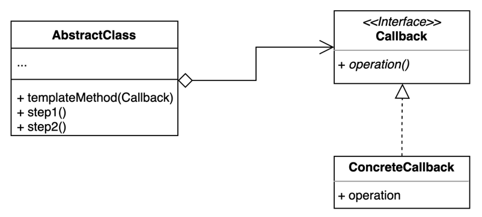

## 템플릿 메소드 패턴 (Template Method Pattern)

### 개념

- 알고리듬 구조의 일부를 서브 클래스가 확장할 수 있도록 템플릿을 제공하는 패턴

---

### 역할



- AbstractClass
  - 공통적인 로직의 템플릿 메서드가 구현된 추상 클래스
  - 템플릿 메서드에서 확장될 수 있는 특정 부분을 추상 메서드로 선언하여 하위 클래스에서 재정의할 수 있게 한다.
- ConcreteClass
  - 템플릿 메서드의 특정한 로직을 재정의한 하위 클래스

---

### 예제

- 파일의 값을 읽어서 합산을 하는 로직을 구현한 FileProcessor 클래스
- 다음 로직에서 합산하는 부분을 다른 로직으로 구현하고 싶으면 로직이 같은 클래스를 만들어서 합산 부분만 다른 로직으로 구현하면 된다.
- 하지만 클래스가 추가될 때마다 같은 로직의 코드가 중복되는 문제가 발생한다.

```java
public class FileProcessor {

    private String path;

    public FileProcessor(String path) {
        this.path = path;
    }

    public int process() {
        try (BufferedReader br = new BufferedReader(new FileReader(this.path))) {
            int result = 0;
            String line;
            while ((line = br.readLine()) != null) {
                result += Integer.parseInt(line);
            }
            return result;
        } catch (IOException e) {
            throw new IllegalArgumentException(this.path + "에 해당하는 파일이 없습니다.");
        }
    }
}
```

- 템플릿 메소드 패턴을 적용하면 FileProcessor 코드 중복과 변경 없이 부분적인 알고리듬을 확장할 수 있다.
- FileProcessor는 템플릿 메서드 역할을 하는 process() 메서드를 구현하고, step()에 해당하는 getResult() 메서드는 하위 클래스에서 구현한다. 




```java
public abstract class FileProcessor {

    private String path;

    protected FileProcessor(String path) {
        this.path = path;
    }

    public int process() {
        try (BufferedReader br = new BufferedReader(new FileReader(this.path))) {
            int result = 0;
            String line;
            while ((line = br.readLine()) != null) {
                result = getResult(result, Integer.parseInt(line));
            }
            return result;
        } catch (IOException e) {
            throw new IllegalArgumentException(this.path + "에 해당하는 파일이 없습니다.");
        }
    }

    protected abstract int getResult(int result, int value);
}
```

```java
public class MultiplyFileProcessor extends FileProcessor {

  public MultiplyFileProcessor(String path) {
    super(path);
  }

  @Override
  protected int getResult(int result, int value) {
    if (result == 0) {
      result = 1;
    }
    return result * value;
  }
}
```

- 클라이언트는 적용 해야하는 부분 로직에 맞게 하위 클래스 인스턴스를 생성해서 템플릿 메서드를 실행할 수 있다.

```java
public class Client {

    public static void main(String[] args) {
        String path = "src/main/java/com/study/designpatterns/min_kim/_22_template_method/number.txt";
        int result;

        FileProcessor plusFileProcessor = new PlusFileProcessor(path);
        result = plusFileProcessor.process();
        System.out.println(result);

        FileProcessor multiplyFileProcessor = new MultiplyFileProcessor(path);
        result = multiplyFileProcessor.process();
        System.out.println(result);
    }
}
```

---

### _템플릿 콜백 패턴 (Template Callback Pattern)_

### 개념

- 콜백으로 상속 대신 위임을 사용하는 패턴
- 전략 패턴과 다른 점은 인터페이스에 정의된 메서드를 두 개 이상 정의할 수 없고, 추가적인 기능이 필요하다면 Callback 인터페이스를 추가해야 한다.

### 역할



- AbstractClass
  - 템플릿 메서드의 AbstractClass처럼 템플릿 메서드를 정의하지만 하위 클래스가 없기 때문에 추상 메서드를 정의하지 않는다.
- Callback
  - 템플릿 메서드에서 확장 해야하는 로직에 대한 operation() 메서드를 정의한 인터페이스
  - AbstractClass가 부분 로직을 위임 할 대상이다.
- ConcreteCallback
  - Callback 인터페이스의 구현체
  - AbstractClass가 위임한 로직이 실제로 구현된 클래스
  - 익명 내부클래스나 람다 표현식으로 대체할 수 있다.

---

### 예제

- 템플릿 메서드는 Operator를 파라미터로 받아서 부분 로직을 처리한다.
- Operator의 구현체는 클라이언트가 필요에 따라 구현체 인스턴스를 인수로 넣거나 람다 표현식으로 간단하게 구현할 수 있다.

```java
public class FileProcessor {

    private String path;

    protected FileProcessor(String path) {
        this.path = path;
    }

    public int process(Operator operator) {
        try (BufferedReader br = new BufferedReader(new FileReader(this.path))) {
            int result = 0;
            String line;
            while ((line = br.readLine()) != null) {
                result = operator.getResult(result, Integer.parseInt(line));
            }
            return result;
        } catch (IOException e) {
            throw new IllegalArgumentException(this.path + "에 해당하는 파일이 없습니다.");
        }
    }
}
```

```java
public class Client {

    public static void main(String[] args) {
        String path = "src/main/java/com/study/designpatterns/min_kim/_22_template_method/number.txt";
        int result = 0;

        FileProcessor plusFileProcessor = new FileProcessor(path);
        result = plusFileProcessor.process(new PlusOperator());
        System.out.println(result);

        FileProcessor multiplyFileProcessor = new FileProcessor(path);
        result = multiplyFileProcessor.process((r, v) -> (r != 0 ? r : 1) * v);
        System.out.println(result);
    }
}
```

---

### 장단점

- 장점
  - 템플릿 코드를 재사용하고 중복 코드를 줄일 수 있다.
  - 템플릿 코드를 변경하지 않고 상속을 받아서 구체적인 로직만 변경할 수있다.
- 단점
  - 리스코프 치환 원칙을 위반할 수 있다.
  - 알고리듬 구조가 복잡할 수록 템플릿을 유지하기 어려워진다.

---

### 자바와 스프링으로 알아보는 템플릿 메소드 패턴

**_HttpServlet_**

- 요청을 받은 ServletContainer가 Request와 Response 인스턴스를 인수로 호출하는 클래스, service() 메서드를 호출한다.
- HttpServlet의 service() 메서드는 템플릿 구조로 설계 되어있고, 하위 클래스에서 doGet(), doPost() 등을 하위 클래스에서 구현하여 로직을 처리할 수 있다.

```java
protected void service(HttpServletRequest req, HttpServletResponse resp)
        throws ServletException, IOException {

        String method = req.getMethod();

        if (method.equals(METHOD_GET)) {
            long lastModified = getLastModified(req);
            if (lastModified == -1) {
                doGet(req, resp);
                ...
            }
        } else if (method.equals(METHOD_POST)) {
            doPost(req, resp);
            ...
        }
    }
```

- doGet(), doPost() 등 템플릿 메서드의 로직을 확장할 수 있다.

```java
public class MyServlet extends HttpServlet {

    @Override
    protected void doGet(HttpServletRequest req, HttpServletResponse resp) throws ServletException, IOException {
        System.out.println("MyServlet doGet() 실행 !");
    }

    @Override
    protected void doPost(HttpServletRequest req, HttpServletResponse resp) throws ServletException, IOException {
        System.out.println("MyServlet doPost() 실행 !");
    }
}
```

**_JdbcTemplate_**

- Java와 DB 통신을 담당하는 로직을 템플릿 메서드로 정의한 스프링이 제공하는 클래스이다.
- 템플릿 메서드인 execute()는 StatementCallback 타입의 Callback 파라미터를 받고, doInStatement() 메서드를 통해서 결과를 받아온다.

```java
private <T> T execute(StatementCallback<T> action, boolean closeResources) throws DataAccessException {
    Assert.notNull(action, "Callback object must not be null");

    Connection con = DataSourceUtils.getConnection(obtainDataSource());
    Statement stmt = null;
    try {
        stmt = con.createStatement();
        applyStatementSettings(stmt);
        T result = action.doInStatement(stmt);
        handleWarnings(stmt);
        return result;
    }
    catch (SQLException ex) {
        // Release Connection early, to avoid potential connection pool deadlock
        // in the case when the exception translator hasn't been initialized yet.
        String sql = getSql(action);
        JdbcUtils.closeStatement(stmt);
        stmt = null;
        DataSourceUtils.releaseConnection(con, getDataSource());
        con = null;
        throw translateException("StatementCallback", sql, ex);
    }
    finally {
        if (closeResources) {
            JdbcUtils.closeStatement(stmt);
            DataSourceUtils.releaseConnection(con, getDataSource());
        }
    }
}
```

- 클라이언트는 필요에 따라 Callback 구현체를 인수로 전달할 수 있다.

```java
public class TemplateCallbackInSpring {

    public static void main(String[] args) {
        String sql = "insert into a (id) values (1)";

        JdbcTemplate jdbcTemplate = new JdbcTemplate();
        jdbcTemplate.execute(sql);
        jdbcTemplate.execute(new StatementCallback<Object>() {
            @Override
            public Object doInStatement(Statement stmt) throws SQLException, DataAccessException {
                stmt.execute(sql);
                return null;
            }
        });
    }
}
```