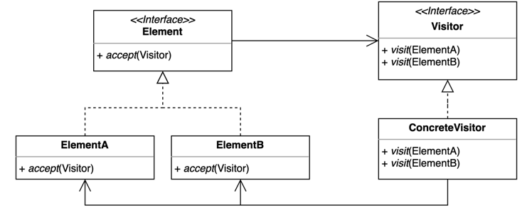

## 방문자 패턴 (Visitor Pattern)

### 개념

- 기존 코드를 변경하지 않고 새로운 기능을 추가하는 패턴
    - 새로운 기능을 추가할 때 기존 코드를 변경할 수 없거나 기존 코드 변경을 원하지 않을 때 사용한다.
- 더블 디스패치를 활용할 수 있다.
    - 더블 디스패치란

---

### 예제

- 어떤 모양을 각각의 디바이스에 맞춰 출력하는 기능을하는 프로그램을 작성한다고 가정한다.
- Rectangle 클래스는 Device의 종류에 따라 다르게 출력해야 하기 때문에 printTo() 메서드 내부에서 분기 로직으로 처리해야 한다.

```java
public class Rectangle implements Shape {

    @Override
    public void printTo(Device device) {
        if (device instanceof Phone) {
            System.out.println("print rectangle to phone.");
        } else if (device instanceof Watch) {
            System.out.println("print rectangle to watch.");
        }
    }
}
```

- 문제점
    - Rectangle 클래스 뿐만 아니라 Shape를 구현하는 모든 클래스에서 Device의 구체적인 타입에 의존하여 코드를 작성해야 한다.
        - Device 변경에 의해서 단일 책임 원칙을 위반하게 되고, Shape 구현체를 추가할 때 마다 모든 분기 로직을 작성해야 한다.

---

### 역할



- Element
    - 변하지 않는 기존에 사용되는 클래스의 인터페이스
    - accept() 메서드에서 Visitor.visit() 메서드를 호출할 때 자신의 인스턴스를 넘겨서 Visitor가 추가적인 작업을 진행할 수 있게 한다.
- Visitor
    - Element가 추가하고 싶은 로직을 정의한 인터페이스
    - visit() 메소드에 오버로딩을 적용해서 다양한 Element 구현체에 대해 추가적인 작업을 처리한다.
        - 즉, Element 구현체의 개수 만큼 메소드를 오버로딩한다.

---

### 방문자 패턴 적용

- 먼저 Visitor의 역할을 하는 Device에 Shape 구현체의 종류에 따라 print() 메소드를 오버로딩하여 정의한다.

```java
public interface Device {

    void print(Triangle triangle);

    void print(Rectangle rectangle);
}
```

- Element에 해당하는 Shape의 구현체인 Rectangle은 단순히 Device의 print() 메소드를 호출하고, Device에서 자신을 출력할 수 있도록 인수로 자신의 참조를 넘겨주기만 한다.

```java
public class Rectangle implements Shape {

    @Override
    public void accept(Device device) {
        device.print(this);
    }
}
```

- Device 구현체인 Phone에서는 Element에 따라 각각의 추가적인 작업을 정의할 수 있다.
- 이렇게 비지터 패턴을 적용하게 되면 Device의 종류가 추가되거나 기능이 변경된다고 해도 Shape 코드는 변경하지 않아도 된다.

```java
public class Phone implements Device {

    @Override
    public void print(Triangle triangle) {
        System.out.println("print triangle to phone");
    }

    @Override
    public void print(Circle circle) {
        System.out.println("print circle to phone");
    }

    @Override
    public void print(Rectangle rectangle) {
        System.out.println("print rectangle to phone");
    }
}
```

---

### 장단점

- 장점
    - 기존 코드를 변경하지 않고 새로운 기능을 추가할 수 있다.
    - 추가 기능을 한 곳에 모아놓을 수 있다.
- 단점
    - 구조가 복잡하고 코드를 이해하기 어렵다.
    - 새로운 Eleement를 추가하거나 제거할 때 Visitor 코드를 변경해야 한다.

---

### 자바와 스프링으로 알아보는 방문자 패턴

**_FileVisitor_**

- Java의 FileVisitor는 파일 및 디렉토리 방문에 필요한 기능을 정의한 인터페이스
- dir 또는 file에 따라 다른 로직을 작성할 수 있고, 동일한 타입을 반환하는 메서드가 정의 되어있다.
  - 메서드 이름이 달라서 오버로딩은 아니지만 기능에 따라 메서드 이름이 다를 순 있다.
- Visitor 패턴 특성상 FileVisitor가 제공하는 기능이 변경되어도 file이나 dir에 해당하는 Element는 변경되지 않는다.

```java
public interface FileVisitor<T> {

    FileVisitResult preVisitDirectory(T dir, BasicFileAttributes attrs);

    FileVisitResult visitFile(T file, BasicFileAttributes attrs);

    FileVisitResult visitFileFailed(T file, IOException exc);

    FileVisitResult postVisitDirectory(T dir, IOException exc);
}
```