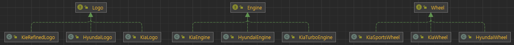

### 객체 생성 패턴: 추상 팩토리 패턴 (Abstract Factory Pattern)

#### 추상 팩토리 패턴이란?
- 추상 팩토리 패턴은 서로 관련이 있는 여러 객체를 만들어서 클라이언트에게 제공해주는 패턴이다.
- 클라이언트는 추상 팩토리의 인터페이스를 통해서 일련의 객체의 군을 공급받을 수 있다.
- 팩토리를 통해서 구체적으로 어떤 클래스의 인스턴스를 사용하는지  감출 수 있다.
---
#### 먼저 팩토리 메서드를 조금 확장한 코드를 보자.
    public class KiaCarFactory implements CarFactory {

        @Override
        public Car createCar() {
            return new KiaCar(
                    new KiaLogo(), <-- 구체적인 클래스
                    new KiaWheel(),
                    new KiaEngine()
            );
        }
    }
- 기아 자동차 인스턴스를 만들 때 로고와 휠, 엔진 세 가지 요소가 필요하다.
- 그런데 현재 코드는 팩토리 클래스가 자동차를 생산할 때 구성 요소에 대해서 구체적인 클래스를 알고 있다.
- 만약에 기아 자동차의 로고가 새롭게 디자인 되거나, 다른 모양의 휠이나 다른 출력의 엔진을 장착하고 싶다면?
- 그때마다 팩토리 클래스 내부 코드를 뜯어 고쳐야 하는 문제가 발생한다.
---
#### 추상 팩토리 패턴을 이용해서 개선해 보자.
- 먼저 각 구성 요소의 인터페이스를 만들고, 인터페이스에 대한 구현체를 종류 별로 여러 개 작성한다.

- 그리고 서로 관련있는 구성 요소를 조합하여 제공할 수 있는 Part Factory 인터페이스를 정의한다.
- Part Factory 인터페이스는 추상 팩토리이며 이 패턴에서 가장 중요한 역할을 한다.

    public interface CarPartFactory {
        Logo createLogo();
        Wheel createWheel();
        Engine createEngine();
    }

- 다음과 같이 CarPartFactory 인터페이스의 구현체를 작성해서 서로 관련 있는 구성 요소를 필요에 따라 조합하여 클라이언트에게 제공할 수 있다.
- (여기서 클라이언트는 구성 요소를 제공받는 CarFactory 구현 클래스를 말한다.)

- *기아 일반 자동차 구성 요소 제공 팩토리 클래스*

 
    public class KiaCarPartFactory implements CarPartFactory {
    
        @Override
        public Logo createLogo() {
            return new KiaLogo();
        }
    
        @Override
        public Wheel createWheel() {
            return new KiaWheel();
        }
    
        @Override
        public Engine createEngine() {
            return new KiaEngine();
        }
    }

- *기아 고급 자동차 구성 요소 제공 팩토리 클래스*

    public class KiaCarAdvancedPartFactory implements CarPartFactory {
    
        @Override
        public Logo createLogo() {
            return new KiaRefinedLogo();
        }
    
        @Override
        public Wheel createWheel() {
            return new KiaSportsWheel();
        }
    
        @Override
        public Engine createEngine() {
            return new KiaTurboEngine();
        }
    }

- *구성 요소 군을 제공받는 클라이언트*
- CarPartFactory 추상 팩토리가 생성해주는 구성 요소를 사용해서 기아 자동차 인스턴스를 생성한다.
- 이렇게 추상 팩토리 패턴을 적용한 후에는 클라이언트 코드를 변경하지 않아도 원하는 구성 요소를 변경할 수 있게 개선되었다.

    public class KiaCarFactory implements CarFactory {
    
        private final CarPartFactory carPartFactory;
    
        public KiaCarFactory(CarPartFactory carPartFactory) {
            this.carPartFactory = carPartFactory;
        }
    
        @Override
        public Car createCar() {
            Logo logo = carPartFactory.createLogo();
            Wheel wheel = carPartFactory.createWheel();
            Engine engine = carPartFactory.createEngine();
    
            return new KiaCar(logo, wheel, engine);
        }
    
    }

- *CarFactory 구현 클래스를 주입 받아 orderCar() 인터페이스를 통해 자동차를 주문하는 고객 클래스* 

    public class Customer {
    
        private final CarFactory carFactory;
    
        public Customer(CarFactory carFactory) {
            this.carFactory = carFactory;
        }
    
        public void orderCar() {
            Car car = carFactory.orderCar();
            car.printCarInfo();
        }
    }

- *Customer 클래스는 자신의 코드를 변경하지 않고 추상 팩토리를 통해서 다양한 제품 군을 주문할 수 있다.*
- 다양한 제품 군을 확장해도 Customer, CarFactory 클래스의 변경은 이뤄지지 않았기 때문에 개방 폐쇄 원칙을 지켰다고 볼 수 있다.
 
 
    public class Application {
        public static void main(String[] args) {
            Customer customer1 = new Customer(new KiaCarFactory(new KiaCarPartFactory()));
            customer1.orderCar();
        
            Customer customer2 = new Customer(new KiaCarFactory(new KiaCarAdvancedPartFactory()));
            customer2.orderCar();
        }
    }

    사용자1가 주문한 자동차 정보 --> Name: KiaCar, Logo: KiaLogo, Wheel: KiaWheel, Engine: KiaEngine
    사용자2가 주문한 자동차 정보 --> Name: KiaCar, Logo: KiaRefinedLogo, Wheel: KiaSportsWheel, Engine: KiaTurboEngine

#### 팩토리 메소드 패턴과 추상 팩토리 패턴은 굉장히 흡사한데 무엇이 다른건가.
- 일단 둘 다 객체 생성 과정을 추상화 한 인터페이스를 제공한다.
- 관점을 다르게 봐야 한다.
  - 팩토리 메소드 패턴은 객체를 생성하는 과정 자체를 추상화 팩토리를 상속하여 '구현하는 방법'에 초점을 둔다.
    - ex) CarFactory, CarPartFactory를 구현하여 ConcreteClass를 생성하는 방법
  - 추상 팩토리 패턴은 팩토리를 '사용하는 방법'에 초점을 둔다.
    - ex) CarFactory의 구현 클래스에서 CarPartFactory를 사용하거나 Customer 클래스에서 CarFactory를 사용하여 인스턴스를 제공받는 방법
- 목적이 다르다.
  - 팩토리 메소드 패턴은 ConcreteClass의 생성 과정을 구체적인 팩토리 클래스로 옮기는 것이 목적이다.
  - 추상 팩토리 패턴은 서로 관련 있는 여러 객체를 구체적인 클래스에 의존하지 않고 만들 수 있게 해주는 것이 목적이다.