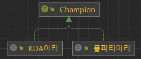

## 브릿지 패턴 (Bridge Pattern)

### 브릿지 패턴 정의

- 브릿지 패턴은 어댑터 패턴과 마찬가지로 구조와 관련된 패턴 중 하나이다.
- 추상적인 것과 구체적인 것을 분리하여 연결한다고 해서 브릿지 패턴이라 불린다.
- 추상적인 것과 구체적인 것을 분리하였기 때문에 각 계층은 독립적으로 발전할 수 있다.
- 클라이언트는 구체적인 Implementation을 직접 사용하지 않고, 추상적인 것을 사용해서 간접적으로 사용한다.


---

### 계층 구조를 하나만 유지하는 경우

- 하나의 계층 구조로 챔피언과 스킨을 표현하면 클래스의 개수가 많아지고 중복 코드가 발생할 수 있다.
- 추가적으로 스킬에 대해서도 표현이 되어야한다면 클래스는 겉잡을 수 없이 많아질 수 있다.



### 위 구조의 문제점

- 두 클래스는 스킨을 제외하고 상태나 행동이 같은 챔피언이기 때문에 코드 중복이 발생한다.
- 아리의 스킨이 추가될 수록 같은 챔피언의 클래스 개수가 증가한다.

```java
public class KDA아리 implements Champion {
    @Override
    public void move() {
        System.out.println("KDA 아리 이동");
    }
    ...
}

public class 풀파티아리 implements Champion {
    @Override
    public void move() {
        System.out.println("풀파티 아리 이동");
    }
    ...
}
```

---

### 브릿지 패턴 적용

- 브릿지 패턴을 적용하여 계층 구조를 분리하게 되면 챔피언과 스킨을 독립적으로 발전시킬 수 있게 된다.
- 스킨과 같은 Implementation이 확장된다 해도 Champion과 같은 Abstraction은 영향을 받지 않는다.


### 문제점 해결

- 스킨을 컴포지션으로 사용하기 때문에 아리의 스킨이 늘어난다고 해도 챔피언 클래스는 늘어나지 않는다.
- 스킨 뿐만 아니라 다른 특성이 추가 된다면, 다른 계층으로 구성하고 연결만 하여 서로 독립적으로 구성하고 발전시킬 수 있다.

```java
public interface Skin {
    String name();
}

public class DefaultChampion implements Champion {

    private final Skin skin; <--
    Implementation 연결
    private final String name;

    public DefaultChampion(Skin skin, String name) {
        this.skin = skin;
        this.name = name;
    }

    @Override
    public void move() {
        System.out.printf("%s %s 이동", skin.name(), this.name);
    }
    ...
}

public class 아리 extends DefaultChampion {

    public 아리(Skin skin) {
        super(skin, "아리");
    }
}
```

---

### 브릿지 패턴 장단점

- 장점
    - 추상적은 코드와 구체적인 코드를 분리함으로써 추상적인 코드를 그대로 유지한 채 구체적인 코드를 변경하거나 확장할 수 있다.
- 단점
    - 계층 구조가 늘어나 복잡도가 증가할 수 있다.

---

### 자바와 스프링에서 찾아보는 브릿지 패턴

**_JDBC_**

- JDBC 인터페이스를 사용하여 Java와 DB를 연결하는 코드를 보면 Driver의 종류에 상관없이 JDBC의 추상화된 인터페이스는 그대로 사용할 수 있다.

```java
public class JdbcExample {

    public static void main(String[] args) throws ClassNotFoundException {
        Class.forName("org.h2.Driver"); // loaded driver (Implementation)

        // ------------- RDBMS의 Driver가 바뀌더라도 아래 코드는 변경되지 않는다. -------------
        try (Connection conn = DriverManager.getConnection("jdbc:h2:mem:~/test", "sa", "")) {

            String sql = "CREATE TABLE ACCOUNT " +
                    "(" +
                    "   id INTEGER NOT NULL," +
                    "   email VARCHAR(255)," +
                    "   password VARCHAR(255)," +
                    "   PRIMARY KEY(id)" +
                    ")";

            Statement statement = conn.createStatement();
            statement.execute(sql);
        } catch (SQLException e) {
            throw new RuntimeException(e);
        }
    }
}
```

- DriverManager에서 컴포지션으로 Driver를 사용하고있기 때문에 Driver가 확장되어도 JDBC 인터페이스에는 영향을 끼치지 않는다.

```java
public class DriverManager {

    // List of registered JDBC drivers
    private final static CopyOnWriteArrayList<DriverInfo> registeredDrivers = new CopyOnWriteArrayList<>();
  
  ...
}
```

**_Slf4j_**

- ...

**_TransactionTemplate_**

- 스프링의 PSA가 적용된 PlatformTransactionManager는 다양한 구현체를 제공한다.


- 스프링은 TransactionManager를 컴포지션으로 사용하여 Transaction을 걸어주는 TransactionTemplate을 제공한다.
- PlatformTransactionManager의 코드가 변경되거나 확장되어도 TransactionTemplate는 영향이 없고, 독립적으로 클라이언트에게 동일한 인터페이스를 제공할 수 있다.

```java
public class BridgeInSpring {

  private static EntityManager em;

  public static void main(String[] args) {
    // 인스턴스를 생성하는 부분은 외부에서 DI로 주입할 수 있다.
    TransactionTemplate transactionTemplate = new TransactionTemplate(new JpaTransactionManager());

    Long examId = transactionTemplate.execute((status) -> {
      Exam exam = em.createQuery("select e from Exam e where e.id = :id", Exam.class)
              .setParameter("id", 1)
              .getSingleResult();
      return exam.getId();
    });
  }
}
```