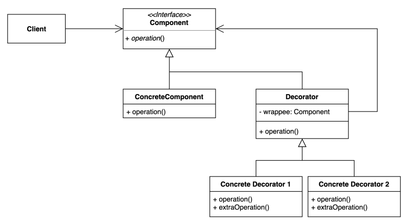

## 데코레이터 패턴 (Decorator Pattern)

### 데코레이터 패턴 정의

- 객체의 결합을 통해서 하나의 기능에 대해 동적으로 확장할 수 있게 해주는 패턴이다.
    - 즉, 기본 기능에 추가할 수 있는 기능이 많을 때 각 기능을 Decorator 클래스로 정의한 후 필요에 따라 동적으로 클래스들을 조합해서 기능에 대해 다양한 조합이 가능하도록 만드는 방식이다.



---

### 추가 기능을 상속으로 조합하기

- 코맨트를 출력하는 기본 기능에 대해서 코맨트에 포함된 ...을 제거하거나 http가 포함된 코맨트를 출력하지 않아야 하는 추가 기능이 필요하다고 가정한다.

```java
// 기본 기능
public class CommentService {

    public void addComment(String comment) {
        System.out.println(comment);
    }
}
```

- 추가 기능을 상속으로 구현

```java
// ... 제거
public class TrimmingCommentService extends CommentService {

    @Override
    public void addComment(String comment) {
        super.addComment(trim(comment));
    }

    private String trim(String comment) {
        return comment.replace("...", "");
    }
}

// http 포함 시 출력하지 않음
public class SpamFilteringCommentService extends CommentService {

    @Override
    public void addComment(String comment) {
        if (isSame(comment)) {
            return;
        }

        super.addComment(comment);
    }

    private boolean isSpam(String comment) {
        return comment.contains("http");
    }
}
```

### 추가 기능을 상속으로 구현했을 때의 문제점

- 컴파일 타임에 추가 기능이 확정되기 때문에 런타임에 동적으로 추가 기능을 변경할 수 없다.
- 즉, 추가 기능을 스팸 차단으로 변경하려면 TrimmingCommentService 대신 SpamFilteringCommentService로 바꾸고 재 컴파일 해야한다.

```java
public class App {
    public static void main(String[] args) {
        Client client = new Client(new TrimmingCommentService()); // compile time

        client.writeComment("오징어 게임");
        client.writeComment("보는게 하는거 보다 재밌을 수 없지...");
        client.writeComment("http://whiteship.me");
    }
}

```

- 부가 기능을 다양하게 조합해야 할 경우 기본 기능을 상속받는 클래스가 급격히 늘어난다.

```java
public class SpamFilteringTrimmingCommentService extends CommentService {

    @Override
    public void addComment(String comment) {
        if (isSame(comment)) {
            return;
        }

        super.addComment(trim(comment));
    }

    private String trim(String comment) {
        return comment.replace("...", "");
    }

    private boolean isSpam(String comment) {
        return comment.contains("http");
    }
}
```

### 데코레이터 패턴을 이용해서 개선하기

- 각 추가 기능을 조합 하더라도 각 기능의 Decorator 객체에 행동을 위임하기 때문에, 추가 기능이 조합된 별도의 CommentService를 상속하는 클래스를 생성하지 않아도 된다.
- 애플리케이션이 동작하는 과정에서 특정 상태 값에 따라 기본 기능에 추가 기능을 동적으로 조합할 수 있다.

```java
public class App {

    private static final boolean ENABLED_TRIMMING = true;
    private static final boolean ENABLED_SPAM_FILTERING = true;

    public static void main(String[] args) {
        CommentService commentService = new DefaultCommentService();

        if (ENABLED_TRIMMING) {
            commentService = new TrimmingCommentDecorator(commentService);
        }

        if (ENABLED_SPAM_FILTERING) {
            commentService = new SpamFilteringCommentDecorator(commentService);
        }

        Client client = new Client(commentService);

        client.writeComment("오징어 게임");
        client.writeComment("보는게 하는거 보다 재밌을 수 없지...");
        client.writeComment("http://whiteship.me");
    }
}
```

---

### 데코레이터 패턴 장단점

- 장점
    - 세로운 클래스를 만들지 않고 추가 기능을 조합할 수 있다.
    - 컴파일 타임이 아닌 런타임에 동적으로 기능을 변경할 수 있다.
- 단점
    - 데코레이터를 조합하는 코드가 복잡할 수 있다.

---

### 자바와 스프링에서 찾아보는 데코레이터 패턴

**_Collections.CheckedList_**

- Collections의 내부 클래스로 정의되어 있는 CheckedList 클래스는 List 구현체가 다루는 값에 대해 타입 체크를 하는 부가 기능을 제공하며, 실제 동작은 list에게 위임한다.

```java
public class DecoratorInJava {
    public static void main(String[] args) {
        List list = new ArrayList<>();
        list.add(new Book());

        List books = Collections.checkedList(list, Book.class);
        books.add(new Item()); // java.lang.ClassCastException 발생 !!
    }
}

// Collections 클래스 내부에 정의되어 있는 데코레이터
static class CheckedList<E> extends CheckedCollection<E> implements List<E> {
  
    final List<E> list;

    CheckedList(List<E> list, Class<E> type) {
        super(list, type);
        this.list = list;
    }

    public E set(int index, E element) {
        return list.set(index, typeCheck(element)); // list 구현체에 set 하기 전에 type check 한다.
    }
}
```

**_BeanDefinitionDecorator_**

- 생략...