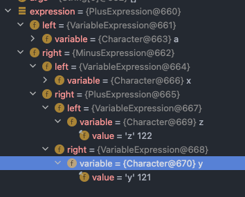

### 인터프리터 패턴
> 자주 등장하는 문제를 간단한 언어로 정의하고 재사용하는 패턴

- 반복되는 문제 패턴을 언어 또는 문법으로 정의하고 확장할 수 있다.

#### 장점
- 자주 등장하는 문제 패턴을 언어와 문법으로 정의할 수 있다.
- 기존 코드를 변경하지 않고 새로운 Expression 을 추가할 수 있다.
  - 단, parser 의 계산식은 수정될 수 있다.

#### 단점
- 복잡한 문법을 표현하려면 Expression 과 Parser 가 복잡해진다.

#### 사용 사례
- [Java - Pattern.matches](./java/InterpreterInJava.java)
- [Spring - SpelExpressionParser](./java/MyService.java)

```

public @interface Value 주석


A common use case is to inject values using #{systemProperties.myProp} style SpEL   (Spring Expression Language) expressions. Alternatively, values may be injected using ${my.app.myProp} style property placeholders.


일반적인 사용 사례는 #{system Properties.my Prop} 스타일 SpEL (Spring Expression Language) 표현식을 사용하여 값을 삽입하는 것입니다. 대안적으로, 값들은 ${my.app.my Prop} 스타일 속성 자리 표시자를 사용하여 주입될 수 있다.
```


#### AST (Abstract syntax tree) 란 ?
> 컴퓨터 과학에서 추상 구문 트리, 또는 간단히 구문 트리는 프로그래밍 언어로 작성된 소스 코드의 추상 구문 구조의 트리이다. 이 트리의 각 노드는 소스 코드에서 발생되는 구조를 나타낸다   
>  
> 출처 : wiki

