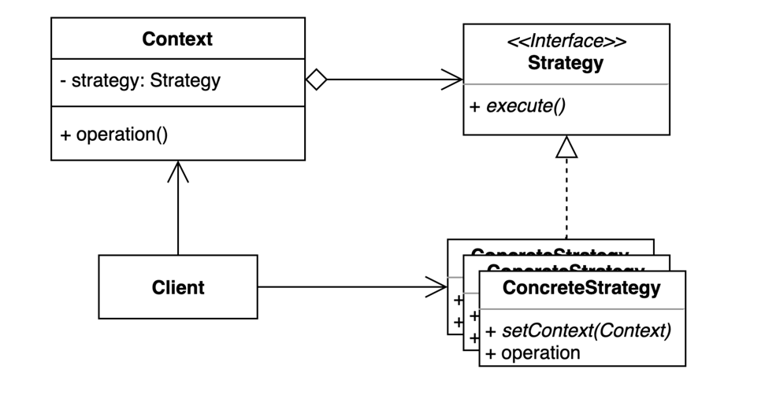

### 전략 패턴
> 여러 알고리즘을 캡슐화하고 상호 교환 가능하게 만드는 패턴.

- 컨텍스트에서 사용할 알고리즘을 클라이언트가 선택한다.

[출처 : (인프런) 백기선-디자인패턴](https://www.inflearn.com/course/%EB%94%94%EC%9E%90%EC%9D%B8-%ED%8C%A8%ED%84%B4)

#### 장점
- 새로운 전략을 추가하더라도 기존 코드를 변경하지 않는다.
- 상속 대신 위임을 사용할 수 있다. (Speed / 컴포지션)
- 런타임에 전략을 변경할 수 있다. (추상화에 의존)

#### 단점
- 복잡도가 증가한다.
- 클라이언트 코드가 구체적인 전략을 알아야 한다. (구현체를 알아야 한다)

#### 사용사례
- compare
- spring
  - ApplicationContext
  - BeanDefinitionParser
  - PlatformTransactionManager
  - CacheManager