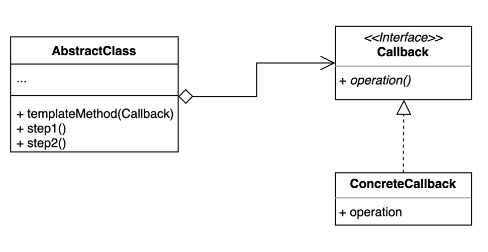

### 템플릿 콟백 패턴
> 콜백으로 상속 대신 위임을 사용하는 템플릿 패턴

- 상속 대신 익명 내부 클래스 또는 람다 표현식을 활용할 수 있다.


[출처 : (인프런) 백기선-디자인패턴](https://www.inflearn.com/course/%EB%94%94%EC%9E%90%EC%9D%B8-%ED%8C%A8%ED%84%B4)

#### 사용 사례

- 콜백 적용 전

````java

public abstract class FileProcessor {
    private String path;

    public FileProcessor(String path) {
        this.path = path;
    }

    public int process(Operator operator) {
        try (BufferedReader reader = new BufferedReader(new FileReader(path))) {
            int result = 0;
            String line = null;
            while ((line = reader.readLine()) != null) {
                result = operator.getResult(result, Integer.parseInt(line));
            }
            return result;
        } catch (IOException e) {
            throw new IllegalArgumentException(path + "에 해당하는 파일이 없습니다.", e);
        }
    }

    protected abstract int getResult(int result, int number);
}


public class Multiply extends FileProcessor{

    public Multiply(String path) {
        super(path);
    }

    @Override
    protected int getResult(int result, int number) {
        return result *= number;
    }
}

public class Plus extends FileProcessor {

    public Plus(String path) {
        super(path);
    }

    @Override
    protected int getResult(int result, int number) {
        return result += number;
    }
}
````