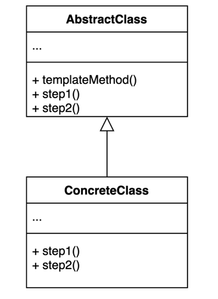

### 템플릿 메소드 패턴
> 알고리즘 구조를 서브 클래스가 확장할 수 있도록 템플릿으로 제공하는 방법

- 알고리즘의 구조를 템플릿으로 제공하고, 그 중에 구체적인 가져오고 처리하고 출력하는 방법 등을 템플릿을 상속받는 서브 클래스가 구현할 수 있도록 해주는 패턴이다.
- 추상 클래스는 템플릿을 제공하고 하위 클래스는 구체적인 알고리즘을 제공한다.


[출처 : (인프런) 백기선-디자인패턴](https://www.inflearn.com/course/%EB%94%94%EC%9E%90%EC%9D%B8-%ED%8C%A8%ED%84%B4)


#### 장점
- 템플릿 코드를 재사용하고 중복 코드를 줄일 수 있다.
- 템플릿 코드를 변경하지 않고 상속을 받아서 구체적인 알고리즘만 변경할 수 있다.

#### 단점
- 리스코프 치환 원칙을 위반할 수도 있다.
  - final 키워드로 템플릿 알고리즘의 역할을 유지할 수 있다.
- 알고리즘 구조가 복잡할 수록 템플릿을 유지하기 어려워진다.


#### 사용사례

- HttpServlet
````java
public class MyHello extends HttpServlet {

    @Override
    protected void doGet(HttpServletRequest req, HttpServletResponse resp) throws ServletException, IOException {
        super.doGet(req, resp);
    }

    @Override
    protected void doPost(HttpServletRequest req, HttpServletResponse resp) throws ServletException, IOException {
        super.doPost(req, resp);
    }
}
````

- configure();
- JdbcTemplate