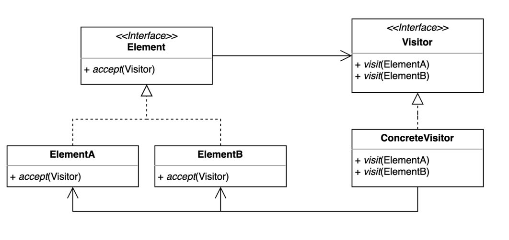

### 방문자 패턴
> 기존 코드를 변경하지 않고 새로운 기능을 추가하는 방법

- 더블 디스패치를 활용할 수 있다.
  - 디스패치는 다형성, 분배, 배치 같은 위임하는 과정을 뜻함
- 엘리먼트에 accept(Visitor) 는 추가되야 한다.

[출처 : (인프런) 백기선-디자인패턴](https://www.inflearn.com/course/%EB%94%94%EC%9E%90%EC%9D%B8-%ED%8C%A8%ED%84%B4)

#### 장점
- 기존 코드를 변경하지 않고 새로운 코드를 추가할 수 있다.
- 추가 기능을 한 곳에 모아둘 수 있다.

#### 단점
- 복잡하다.
- 새로운 Element 를 추가하거나 제거할 때 모든 Visitor 코드를 변경해야 한다.

#### 사용사례
- FileVisitor, SimpleFileVisitor
- AnnotationValueVisitor
- ElementVisitor
- BeanDefinitionVisitor