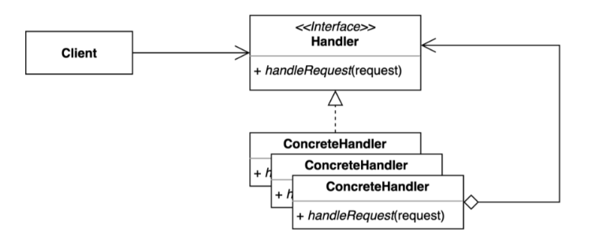

> ### 행동 관련 디자인 패턴

## 책임 연쇄 패턴 ( Fly Weight Pattern )

---

요청을 보내는 쪽과 요청을 처리하는 쪽을 분리하는 패턴



핸들러 체은을 사용하여 요청을 처리한다 .

```java
// Handler 역할을 하는 Interface를 작성한다
public abstract class RequestHandler {

  private RequestHandler nextHandler;

  public RequestHandler(RequestHandler nextHandler) {
    this.nextHandler = nextHandler;
  }

  public void handle(Request request) {
    if (Objects.nonNull(nextHandler)) {
      this.nextHandler.handle(request);
    }
  }
}

public class PrintRequestHandler extends RequestHandler {

  public PrintRequestHandler(RequestHandler nextHandler) {
    super(nextHandler);
  }

  @Override
  public void handle(Request request) {
    System.out.println("PrintRequestHandler :: " + request.getBody());
    super.handle(request);
  }
}
```

```java
//Client

public class Client {
  private RequestHandler requestHandler;

  public Client(RequestHandler requestHandler) {
    this.requestHandler = requestHandler;
  }
  
  public void doWork() {
    Request request = new Request("Hello Chain of responsibility pattern");
    requestHandler.handle(request);
  }
}
```

```java

public class Main {
  public static void main(String[] args) {
    RequestHandler chain = new PrintRequestHandler(new XXX(request));
    Client client = new Client(chain);
    client.doWork();
  }
}
```

요청을 하는부분과 요청을 처리하는부분이 디커플링되어있어 어떠한 핸들러를 써서 처리를 해야할지 몰라도된다.

---

## 책임 연쇄 패턴의 장 단점

장점 
 - Client코드를 변경하지 않고 얼마든지 새로운 핸들러를 처리할 수있고, 순서를 변경하여도 유연하게 처리할 수 있다.
 - 각각의 핸들러가 각각의 책임을 가지고 있기때문에 `단일 책임 원칙`을 위배하지 않는다.
 
단점
 
 - 연쇄적으로 흘러가다보니 디버깅하다가 복잡한 구조라면 번거로워 확인하기 어렵다.
 - 순서 및 연쇄 내용을 충분한 테스트를 거치지 않는다면 내부에서 순환참조가 발생할 수 있다.

------

## 책임 연쇄 패턴을 사용하고있는 Java 또는 Spring 기술

1. Filter ( 자바에서는 서블릿 필터, 스프링에서는 스프링 시큐리티 필터 )

   - FilterChain의 doFilter를 사용하여 처리할 수 있으며 doFilter()호출 전후로 데이터 처리가능. 