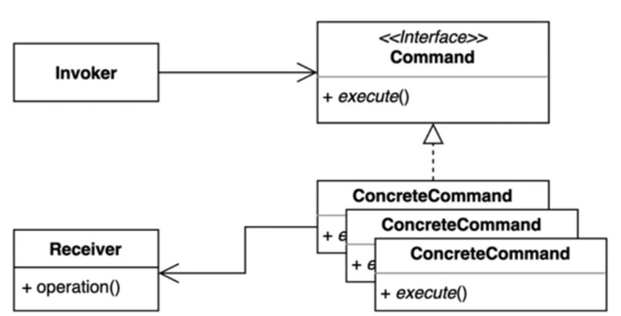

> ### 행동 관련 디자인 패턴

## 커맨드 패턴 ( Command Pattern )

---

요청을 캡슐화 하여 호출자와 수신자를 분리하는 패턴
> 요청을 처리하는 방법이 변경되어도 호출자의 코드는 변경되지 않는다.

#### Invoker 
 - 기능의 실행을 요청하는 클래스 

#### Command ( 자바의 Runnable과 유사 )
 - 실행 기능에 대한 인터페이스
 - 실행될 기능을 execute 메서드로 선언 ( Runnable의 run() )

#### ConcreteCommand
 - 실제로 시행되는 기능을 구현
 - 즉, Command Interface를 구현함

#### Receiver
 - ConcreteCommand 에서 execute 메서드를 구현할 때 필요한 클래스
 - ConcreteCommand 기능을 실행하기 위해 사용하는 수신자 클래스

---

커맨드 패턴의 장단점

장점
 - 각각 기능에 대해 캡슐화가 되다보니 결합도가 낮아진다.

단점
 - 리시버 객체의 동작이 늘어날때마다 ConcreteCommand 의 클래스가 늘어나 클래스가 많아진다.