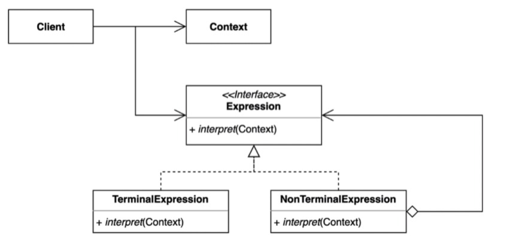

> ### 행동 관련 디자인 패턴

## 인터프리터 패턴 ( interpreter Pattern )

---

자주 등장하는 문제를 간단한 언어로 정의하고 재사용하는 패턴. ( 컴포짓 패턴과 유사 )

Expression 
 - 실질적으로 표현하는 문법을 나타낸다.

TerminalExpression ( 해당 예제에서의 숫자값들을 의미 )
 - 그 자체로 종료되는 Expression

NonTerminalExpression ( 기호들을 의미한다고 보면 편함, + , - 와 같은)
 - 다른 Expression 들을 참조하고있는 Expression
 - 또다른 NonTerminalExpression 을 참조할 수 있고, TerminalExpression 을 참조할 수 있다.

---

주로 Postfix로 설명하기 때문에 따로 예제는 설명하지 않고 링크로 대체 .

https://velog.io/@cham/Design-Pattern-%EC%9D%B8%ED%84%B0%ED%94%84%EB%A6%AC%ED%84%B0-%ED%8C%A8%ED%84%B4Interpreter-Pattern

---

### 인터프리터 패턴의 장 단점

장점

 - 자주 사용하는 문법 규칙을 클래스로 표현하기 때문에 언어를 쉽게 구현할 수 있다.
 - Context만 변경해가면서 사용하기때문에 재활용 할 수 있다.
 - 기존 코드를 건드리지 않고 얼마든지 확장할 수 있다.

단점

 - 복잡한 문법을 표현하려면 Expression과 Parser가 복잡해진다.

---

### 인터프리터가 적용된 내용

Java 
 - 정규 표현식

Spring
 - ExpressionLanguage
 - Springframework.beans.factory.annotation.Value - @Value