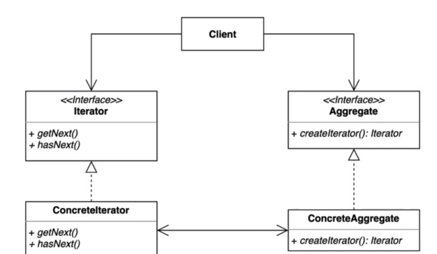

> ### 행동 관련 디자인 패턴

## 이터레이터 패턴 ( iterator Pattern ) - 반복자 패턴이라고도 부름

---

> 집합 객체 내부 구조를 노출시키지 않고 순회 하는 방법을 제공하는 패턴




### iterator
> 집합체의 요소들을 순서대로 검색하기 위한 인터페이스 정의

### ConcreteIterator
> Iterator 인터페이스를 구현함
> 
> ArrayList 내부의 Innerclass Itr을 찾을수 있음 

### Aggregate
> 여러 요소들로 이루어져 있는 집합체

### ConcreteAggregate
> Aggregate 인터페이스르르 구현하는 클래스

---
```java
// 기본적으로 java에서 제공하는 iterator를 사용.

Iterator<Entity> iter = list.iterator();
while(iter.hasNext()) {
  // 아래와 같이 사용 가능 
  iter.next().xx();  
}
```

직접 구현해서 사용하고자 한다면 다음과 같이 작성 가능

```java

public class CustomIterator implements Iterator<Entity> {
  private Iterator<Entity> entityIterator;

  // 해당부분에서 list에 대한 정렬 진행 .
  public CustomIterator(Entities entities) {
    List<Entity> entities = entities.getEntity();
    this.entityIterator = entities.iterator();
  }
  
  @Override
  public boolean hasNExt() {
    // return false;
    return this.entityIterator.hasNext();
  }
  
  @Override
  public Entity next() {
    return this.entityIterator.next();
  }
}
```
--- 

### 이터레이터 패턴의 장,단점

장점

 - 집합체 클래스의 응집도를 높여준다.
 - 집합체의 내부 구조를 알 필요 없이, 집합체 안에 있는 모든 항목에 접근 가능.
 - 모든 항목에 대해서 일일이 접근하는 작업을 컬렉션 객체가 아닌 이터레이터가 객체에서 맡게 된다. 

단점

 - 단순한 순회를 구현하는 경우 클래스만 많아져 복잡도가 증가할 수 있다.

---

### 이터레이터가 적용되있는 부분

Java
 - Enumeration과 Iterator가 적용되어 있음.
 - Java Streaming API for XML의 Iterator 기반 API
   - XmlEventReader, XmlEventWriter

Spring
 - CompositeIterator