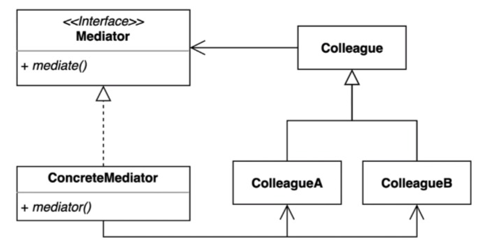

> ### 행동 관련 디자인 패턴

## 중재자 패턴 ( mediator Pattern )

---

> 여러 컴포넌트간의 결합도를 중재자를 통해 낮출 수 있다. 
> 여러 객체들이 소통하는 방법을 캡슐화 하는 패턴.

컴포넌트들의 결합도를 낮추기 위해 위임을 받아서 처리하는 부분이 Mediator가 된다
Mediator 가 의존성들을 관리하기때문에 각각의 의존성들은 Mediator에 몰아주고 각 Colleague들은 의존성에 대해 알 필요가 없다.

동영상 강의에서 의미하는 Guest에 대한 정보들을 CleaningService와 Restaurant에서 알 필요 없이 Guest에 대한 Id를 가지고 처리 함으로써
Guest에 대한 의존성을 갖지 않고, Mediator클래스인 FrontDesk에서 처리한다.

---

### 중재자 패턴의 장,단점

장점

 - 컴포넌트 코드를 변경하지 않고 새로운 중재자를 만들어 사용가능하다. (예제 소스에서는 불가능 Interface로 만들어야 가능.)
 - 각각의 컴포넌트 코드를 보다 간결하게 유지 가능.

단점

 - 중재자 역할을 하는 클래스의 복잡도와 결합도가 증가한다. ( FrontDesk class ) 
 - 현실의 매니저와 유사하다. (매니저가 모두 관리하지만 매니저가 그만큼 스트레스를 받게된다.)

---

중재자 패턴이 적용되어있는 Java, Spring 코드

Java
 - ExecutorService
 - Executor

Spring
 - DispatcherServlet
