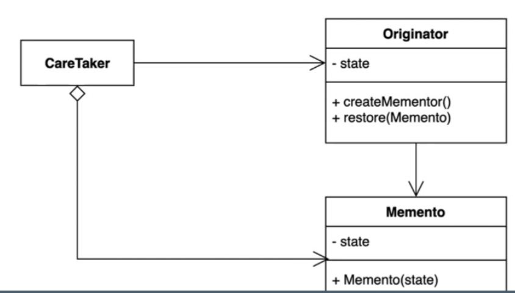

> ### 행동 관련 디자인 패턴

## 메멘토 패턴 ( Memento Pattern )

---

객체 내부의 상태를 외부에 저장해서 복원해서 사용하는 패턴.
핵심적인 객체의 캡슐화 유지,



- ### CareTaker
> Originator의 내부정보를 CareTaker가 가지고와서 저장한다. 가지고 있는 정보로 다시 복원가능.

- ### Originator
>  저장하는 방법과 복원하는 방법을 제공하는 클래스 ( 예제에서의 Game Class를 의미)

```java
@Getter
@Setter
public class Game{ 
  private int redTeamScore;
  private int blueTeamScore;
  
  public GameSave save() {
    return new GaneSave(this.blueTeamScore, this.redTeamScore)
  }
  
  public void restore(GameSave gameSave) {
    this.blueTeamScore = gameSave.getBlueTeamScore();
    this.redTeamScore = gameSave.getRedTeamScore();
  }
}
```

- ### Memento
> 특정 시점의 상태정보를 저장하는 클래스 ( 예제에서는 GameSave Class를 의미 )

```java
public class GameSave {
  private int redTeamScore;
  private int blueTeamScore;
  
  public GameSave(int blueTeamScore, int redTeamScore) {
    this.redTeamScore = redTeamScore;
    this.blueTeamScore = blueTeamScore;
  }
}
```
--- 

메멘토 패턴의 장단점

장점

 - 저장된 상태를 핵심 객체와는 다른 별도의 객체에 보관하기 때문에 안전하다.
 - 핵심 객체의 데이터를 계속 캡슐화 하여 유지 가능
 - 복구 기능을 구현하기 쉽다.

단점

 - 메멘토 객체를 써서만 저장 가능.
 - 자바에서 상태를 저장ㅇ할때는 직렬화를 사용하는것이 좋다.

---

Java, Spring에서의 메멘토패턴

 - Date ( 내부 정보가 노출되있는데 모멘토로 봐도 괜찮을까 고민 )
 - 직렬화, 역직렬화
 - 