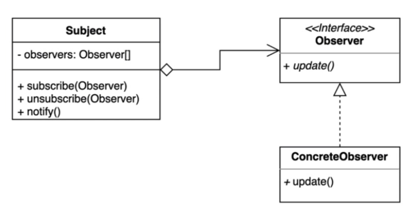

> ### 행동 관련 디자인 패턴

## 옵저버 패턴 ( observer Pattern )

---

> 다수의 객체가 특정 객체 상태 변화를 감지하고 알림을 받는 패턴

발행 및 구독 패턴을 구현할 수 있다 ( pub/sub )



```java
public class ChatServer {
  private Map<String, List<Subscriber>> subscribers = new HashMap<>();
  
  public void register(String subject, Subscriber subscriber) {
    if(subject.containeKey(subject)) {
      subscribers.get(subject).add(subscriber);
      return;
    }
    
    List<Subscriber> list = new ArrayList<>();
    list.add(subscriber);
    this.subscribers.put(subject, list);
  } 
  
  public void unregister(String subject, Subscriber subscriber) {
    if(subscribers.containsKey(subject)) {
      subscribers.get(subject).remove(subscriber);
    }
  }
  
  public void sendMessage(User user, String subject, String message) {
    if(this.subscribers.containsKey(subject)) {
      this.subscribers.get(subject).forEach(s -> s.handleMessage(message));
    }
  }
}
```

```java
// Observer 역할 
public interface Subscriber {
  void handleMessage(String message);
} 

 ```

```java
public class User implements Subscriber {
  private String name;

  public User(String name) {
    this.name = name;
  }

  public String getName() {
    return this.name;
  }

  @Override
  public void handleMessage(String message) {
    System.out.println(message);
  }
}
```

---

옵저버 패턴의 장단점

장점

 - Publisher와 Subscriber의 관계를 느슨하게 유지할 수 있음.
 - Subject의 상태변경을 주기적으로 조회하지 않고 자동 감지 가능
 - 런타임에 옵저버를 추가하거나 제거할 수 있다.

단점

 - 복잡도가 증가한다
 - 다수의 Observer객체를 등록 후 해지하지 않는다면 memory leak이 발생할 수도 있다.
   - 해지하지 않는 이상 GC의 대상이 되지 않는다.
   - WeakReference를 사용하면 자동으로 해지해주지만, 명시적으로 직접 해제해주는 방법이 제일 좋음,.

---

Java와 Spring에 적용되어있는 Observer Pattern

Java
 - Observer interface (deprecated java 9), Observable class 
   - 상태가 무조건 변경되었다고 알려야지만 알림을 받을 수 있음.
 - PropertyChangeListener, PropertyChangeSupport 구현 
   - Observer과 Observable보다 더 많은 정보를 얻을 수 있음, ex) old value, new value
 - Flow.Publisher, Flow.Subscriber, Flow.Subscription, Flow.Processor( Subscriber, Publisher둘다 같이 한다. )

Spring
 - ApplicationContext 사실상 Event Publisher