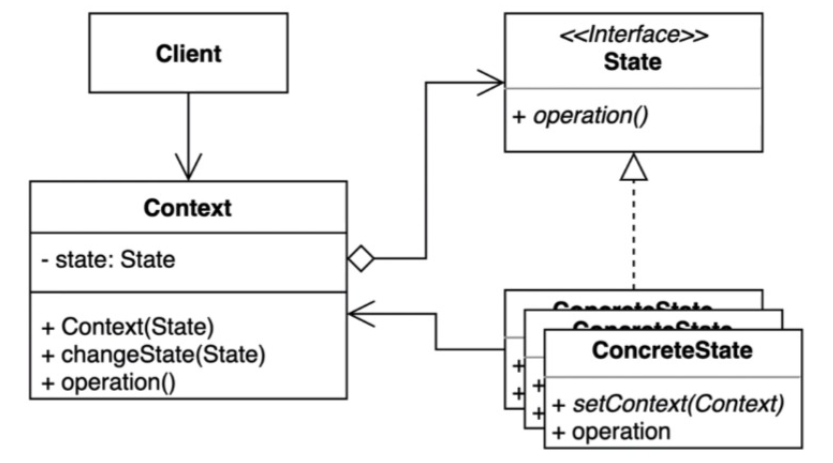

> ### 행동 관련 디자인 패턴

## 상태 패턴 ( State Pattern )

---

객체 내부 상태 변경에 따라 객체의 행동이 달라지는 패턴

> 상태에 특화된 행동들을 분리해 낼 수 있으며, 새로운 행동을 추가하더라도 다른 행동에 영향을 주지 않는다.

---

상태패턴의 장점과 단점

장점

 - 상태에 따른 동작을 개별 클래스로 옮겨서 관리 가능. (가장 큰 장점. SRP )
 - 기존의 특정 상태에 따른 동작을 변경하지 않고 새로운 상태에 다른 동작을 추가 가능 ( Draft, Private 등등)
 - 코드 복잡도를 줄일 수 있다. ( 개별 클래스가 관리 )

단점
 - 복잡도가 증가한다 ( 상태에 따른 파일 증가 )